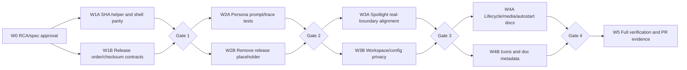

# RCA and Remediation Specification — Documentation/Code Alignment

## 1. Decision record

- Complexity: **C-3 — Architecture-Driven Implementation**
- Change risk: **HIGH** — กระทบ release pipeline, security/privacy boundary,
  desktop lifecycle, persona contract และ cross-layer tests
- Product version: **คง 0.5.0** เพราะเป็นการทำให้ feature branch ที่ยังไม่
  release ตรงตาม contract เดิม ไม่ใช่การเพิ่ม public feature
- Baseline: commit `3a6657caf0519f54b8bee05658f3047856e64b65`
- Approval: **อนุมัติโดย Boss (บอส), 2026-09-04**
- Implementation state: implementation และ local automated gates เสร็จแล้ว;
  fresh PR CI และ manual release evidence ยังเป็น exit gates แยกกัน

## 2. Goal and scope

ทำให้ PR #1 มี documentation, runtime, tests และ Windows release workflow
ตรงกันโดยไม่เพิ่ม permission, WebView IPC, cloud service หรือ feature ใหม่
นอกขอบเขตที่อนุมัติไว้

[ASSUMPTIONS]

1. No-WebView-IPC และ least-privilege capability เป็น security source of truth
   ที่ต้องคงไว้
2. Persona PRD เป็น product source of truth สำหรับตัวตน, anti-sycophancy และ
   Placeholder Doctrine
3. Clean-machine Windows 10/11, code signing และ per-model behavioral evaluation
   ยังเป็น manual release evidence; automated test ห้ามอ้างว่าแทนหลักฐานเหล่านี้
4. Environment override `RWANG_WORKSPACE_DIR` เป็น operator consent ชั่วคราว
   จนกว่าจะมี settings UI หรือ native folder picker ที่ได้รับอนุมัติแยกต่างหาก

## 3. Symptom

การตรวจ local ให้ผลผ่านหลาย gate แต่ fresh GitHub runner ล้มก่อนถึง security,
Rust และ build gates ขณะเดียวกันเอกสารบางส่วนอธิบาย command, architecture,
data path, release artifact และ persona behavior ไม่ตรงกับ implementation จริง
ทำให้ผล “tests passed” และข้อความ “same gates” ให้ความเชื่อมั่นเกินหลักฐาน

## 4. Evidence

### 4.1 CI and release

1. GitHub Actions run `33674368217`, job `100395379042` ผ่าน runtime acquisition
   ใน `pwsh` แต่ `pnpm desktop:stage` เปิด nested `powershell.exe` แล้วล้มที่
   `Get-FileHash is not recognized`; downstream security/Rust/build ไม่ได้รัน
2. `package.json` เรียก `powershell` สำหรับ `desktop:runtime` และ
   `desktop:stage` ขณะที่ workflow outer shell เป็น `pwsh`
3. `README.md` เรียก security ก่อน stage แต่ release workflow ตั้งใจตรวจ
   `stage -> security -> desktop contract -> build`
4. `docs/desktop-package-staging.md` ขาด
   `--config.enable-global-virtual-store=false` ที่ script ใช้จริง และ contract
   test ตรวจเพียง substring เก่า
5. `docs/desktop-release.md` ใช้ glob `RWANG-*.exe` แต่ artifact จริงใช้รูปแบบ
   `RWANG_0.5.0_x64-setup.exe`
6. workflow สร้าง `sbom-placeholder.json` ทั้งที่ Persona Placeholder Doctrine
   ห้าม placeholder อยู่ใน release artifact

### 4.2 Persona and UI disclosure

1. `docs/PRD-RWANG-PERSONA.md` กำหนด meaning ของชื่อ, narrative ชาย/25 ปี,
   role, DDD/RCA, self-correction และ scope discipline
2. shared system prompt ใน `rwang.mjs` มี identity, local/Ollama,
   anti-sycophancy, uncertainty และ placeholder honesty แต่ยังไม่ encode
   name meaning, narrative boundary, role/method, PER-010 และ PER-012 ครบ
3. `tests/persona-scenarios.mjs` ตรวจว่า expected string ไม่ว่างและ prompt match
   broad policy regex แต่ไม่ได้ตรวจว่า expected behavior ของแต่ละ scenario
   map กับ policy จริง; ข้อความ “33 scenarios passed” จึงไม่ใช่ model evaluation
4. automated coverage gate บังคับเฉพาะ PER-013 ถึง PER-020 แม้ PRD ระบุ
   PER-001 ถึง PER-020 เป็น in-scope requirements
5. disclosure UI ใช้ขนาดตัวอักษร 9px และ mobile rule ไม่เพิ่มขนาด จึงยังไม่มี
   หลักฐานรองรับ NFR ว่าอ่านได้บน mobile

### 4.3 Spotlight, workspace and desktop lifecycle

1. `docs/spotlight-native-boundary.md` สั่ง wire `invoke_handler` และ strict
   path-scoped URL helper แต่ `tests/tauri-contract.mjs` ห้าม WebView IPC และ
   production `main.rs` ใช้ exact loopback-origin navigation gate
2. strict URL helper/test ใน `spotlight_bridge.rs` ไม่ได้อยู่ใน production
   navigation path จึงทดสอบ boundary คนละตัวกับที่ใช้งานจริง
3. เอกสารระบุ global shortcut เป็นอนาคต แต่ `Ctrl+Shift+Space` ถูก implement แล้ว
4. `docs/desktop-dag.md` ระบุ `%APPDATA%\RWANG` แต่ packaged desktop ใช้
   `%LOCALAPPDATA%\com.freshair129.rwang\data`
5. DAG เรียก workspace ว่า user-approved แต่ packaged runtime fallback ไป
   Documents โดยไม่มี picker หรือ approval
6. README ทำให้เข้าใจว่า packaged desktop อ่าน `.env`; จริงมีเพียง `pnpm start`
   ที่โหลด repo `.env` และ staged runtime ไม่ bundle ไฟล์ดังกล่าว
7. diagnostics ถูกเรียกว่า local-only แต่ route ไม่มี access-control contract;
   harness รองรับ/รับรองเฉพาะ exact loopback origin และไม่ส่ง telemetry
8. runtime docs ไม่ระบุ mandatory `RWANG_DESKTOP_NONCE` และบรรยาย shutdown
   ไม่ตรงกับ graceful stdin request แล้ว fallback `taskkill /T /F`
9. autostart เป็น optional Cargo feature ที่ default ปิด แต่ DAG ทำให้ตีความว่า
   shipped แล้ว
10. clean checkout อาจสร้าง PNG fallback ขนาด 1x1 ใน `build.rs`; production
    release จึงไม่ fail closed เมื่อ branded icon input หาย

### 4.4 Documentation governance

1. versioned desktop docs ส่วนใหญ่ไม่มี YAML lifecycle metadata และ CHANGELOG
   ตาม global governance schema
2. Persona PRD และ pnpm RCA ยังบันทึก implementation commit เป็น `uncommitted`
3. desktop DAG ใช้คำว่า Wave 4/5 สำเร็จได้ แม้ยังไม่มี clean-machine Windows
   10/11, installer lifecycle หรือ signed-release evidence

## 5. Root Cause

Root cause ไม่ใช่ bug เดี่ยว แต่เป็น **การไม่มี executable cross-layer contract
ที่เป็น source of truth เดียว** ระหว่าง docs, package scripts, PowerShell hosts,
Rust host, Node sidecar, UI และ release workflow:

1. environment-sensitive hashing พึ่ง command discovery ของ PowerShell module
   และไม่มี PS 5.1/pwsh parity gate
2. static tests ตรวจ keyword/substring แทน semantics, ordering และ production
   wiring จึงผ่านได้แม้ docs หรือ helper ไม่ตรงกับเส้นทางจริง
3. status/acceptance text ไม่แยก automated evidence ออกจาก manual release
   evidence ทำให้เอกสารประกาศความพร้อมเกินผลทดสอบ
4. persona requirements ถูกเขียนหลัง implementation บางส่วน แต่ coverage test
   ไม่บังคับ traceability ของทุก requirement

## 6. Why the issue escaped detection

- local machine มี command/module/path state ต่างจาก fresh runner
- workflow test ตรวจลำดับเชิงข้อความ แต่ไม่ได้ execute stage ใน shell-host matrix
- tests ของ Spotlight ตรวจ helper ที่ไม่ได้ wire ใน production
- scenario catalog ตรวจ prompt presence ไม่ได้ตรวจ policy-to-expected mapping
- docs review ไม่มี versioned cross-reference matrix และ release-claim gate
- placeholder artifact ถูกติดป้ายตรงไปตรงมา แต่ไม่มี release-scope prohibition test

## 7. Normative remediation decisions (implemented)

### D1 — Deterministic SHA-256 and shell parity

- สร้าง helper PowerShell `Get-Sha256Hex` ด้วย .NET
  `System.Security.Cryptography.SHA256` และ dispose stream ใน `finally`
- ใช้ helper เดียวกันใน acquisition, staging และ checksum collection;
  scripts ห้ามพึ่ง `Get-FileHash`
- CI เรียก scripts ด้วย explicit `pwsh`; developer package scripts ยังคงรองรับ
  Windows PowerShell 5.1
- เพิ่ม known-digest fixture, mismatch fail-closed และ parity gate ทั้งสอง hosts

### D2 — One release command/order contract

ลำดับมาตรฐานคือ:

```text
pnpm install --frozen-lockfile
pnpm check
pnpm desktop:runtime
pnpm desktop:stage
pnpm test:security
pnpm test:desktop-package
pnpm test:model-selector-layout
pnpm test:desktop-contract
git diff --check
cargo fmt/check/test
tauri build
```

- README, staging doc, release doc และ workflow ต้องใช้ ordering เดียวกัน
- production install command ต้องบันทึก flag เต็ม:
  `pnpm --config.enable-global-virtual-store=false install --prod --frozen-lockfile --ignore-scripts --node-linker=hoisted`
- contract test ต้องตรวจ exact flags, relative ordering และ actual artifact name
- checksum verification ต้องพบ installer exactly one file, recompute digest และ
  compare filename/hash กับ `SHA256SUMS.txt`

### D3 — Placeholder-free release scope

- ลบการสร้าง/upload/reference `sbom-placeholder.json`
- release artifact มี installer และ `SHA256SUMS.txt` เท่านั้นจนกว่าจะอนุมัติ
  real SBOM generator
- เพิ่ม targeted release-scope scan ที่ห้าม placeholder artifact/metadata โดยไม่
  false-positive กับ HTML input `placeholder` หรือ test fixture ที่ตั้งใจใช้

### D4 — Persona is an executable trust contract

- shared prompt เดียวของ ToolLoopAgent และ native Ollama fallback ต้องเพิ่ม:
  name meaning as disclosure, narrative-not-human boundary, role/method,
  PER-010 self-correction, PER-011 material-ambiguity handling, PER-012 scope
  discipline, least privilege และ anti-dependency
- scenario catalog ต้อง map ทุก scenario ไปยัง policy ที่มีทั้ง
  `promptPattern` และ `expectedPattern` และ assert สองด้าน
- coverage gate ต้อง trace PER-001 ถึง PER-020; output ใช้คำว่า
  “persona prompt-policy catalog passed” ห้ามสื่อว่าได้รัน local models แล้ว
- Persona Beta ยังคง beta จน per-model manual evaluation ผ่าน
- disclosure text ขั้นต่ำ 12px/0.75rem และยังอยู่ใต้ model selector ทั้ง desktop/mobile

### D5 — Preserve the no-WebView-IPC Spotlight architecture

- Node `spotlight.mjs` เป็น index/open authority เดียว
- Rust เป็น host-triggered focus/shortcut/lifecycle boundary; ห้ามเพิ่ม
  `invoke_handler`, shell หรือ filesystem capability
- production navigation contract อนุญาตเฉพาะ
  `http://127.0.0.1:<selected-port>` แต่ path/query/fragment ภายใน origin เดียวกัน
  ใช้งานได้; HTTPS, localhost, userinfo, wrong port และ new windows ถูกปฏิเสธ
- ลบหรือ repurpose strict helper/test ที่ไม่อยู่ใน production path เพื่อให้ tests
  ตรวจ gate ใน `main.rs` จริง
- docs ระบุ `Ctrl+Shift+Space` เป็น implemented global shortcut และ
  `Ctrl/Cmd+K` เป็น browser shortcut; registration conflict เป็น non-fatal warning

### D6 — Explicit workspace and configuration ownership

- packaged desktop ที่ไม่กำหนด `RWANG_WORKSPACE_DIR` ใช้ isolated empty root
  `%LOCALAPPDATA%\com.freshair129.rwang\workspace` ไม่ fallback ไป Documents
- explicit override ต้องเป็น absolute valid directory; invalid value fail ชัดเจน
- development checkout ยังใช้ repository root ได้
- Spotlight personal-folder defaults เป็น feature แยกจาก Document Intelligence
  workspace และต้องอธิบาย root list/index behavior ให้ตรงกับ implementation
- `pnpm start` เท่านั้นที่โหลด repo `.env`; packaged desktop ไม่อ่าน/ไม่ bundle
  `.env` และ host เป็นเจ้าของ resource/data/capability/host/port/nonce
- settings UI/native folder picker อยู่นอก patch นี้

### D7 — Accurate lifecycle, diagnostics and optional features

- เรียก diagnostics ว่า loopback-supported/on-device/no-telemetry attestation
  ไม่อ้างว่าเป็น route ACL
- docs ระบุ nonce 32 random bytes, child-environment-only และ challenge/HMAC
  readiness proof; nonce ไม่อยู่ URL/argv/log/response
- ปุ่ม X hide-to-tray และ sidecar ยังทำงาน; Tray Quit/process exit ส่ง shutdown
  ผ่าน stdin รอไม่เกิน 7 วินาที แล้วใช้ bounded `taskkill /T /F` fallback
- autostart ระบุว่า optional Cargo feature, default release ปิด และยังไม่มี UI toggle
- data/rollback path ใช้ `%LOCALAPPDATA%\com.freshair129.rwang\data` และแยก
  browser state `%LOCALAPPDATA%\RWANG\data`; ห้ามลบ data เพื่อ troubleshoot

### D8 — Release assets and evidence claims fail closed

- branded `icon.png` และ `icon.ico` ต้องเป็น deterministic checked-in release inputs
- production build ห้ามสร้าง 1x1 source fallback; missing/corrupt icon ต้อง fail
- contract test ตรวจ signatures/dimensions/image count และ build ห้าม mutate icons
- hosted `windows-latest` เป็น build gate ไม่ใช่หลักฐาน clean-machine/Windows matrix
- Wave 4/5 และ “production-ready” ยังไม่ complete จนมี Windows 10/11 clean VM,
  upgrade/uninstall/data-retention/rollback และ code-signing evidence ตาม release policy

### D9 — Documentation lifecycle and traceability

- เพิ่ม schema-compliant frontmatter, version diff และ CHANGELOG ให้ versioned docs
- แก้ historical implementation references ให้ชี้ commit `3a6657c...` เมื่อเป็น
  fact ที่ commit นั้นรองรับ; candidate remediation ใช้ `uncommitted` จน commit จริง
- เพิ่ม doc-contract tests สำหรับ commands, status language, paths, optional/manual
  gates และห้ามกล่าวอ้าง completion เกิน evidence

## 7.10 Local verification evidence

- staging ผ่านทั้ง Windows PowerShell 5.1 และ PowerShell 7 ด้วย pinned Node
  v24.20.0; manifest มี 2,419 files และไม่มี `.env`/pnpm metadata ต้องห้าม
- `pnpm check`, persona 45-case prompt-policy catalog, post-stage security,
  desktop package, model selector, desktop health/sidecar, Tauri และ media parity
  contracts ผ่าน; catalog ระบุชัดว่าไม่มี model execution
- Rust ผ่าน 8 unit tests, 2 icon corruption/decode tests และ 2 Spotlight
  integration tests; default และ optional autostart builds compile
- missing, truncated และ payload-corrupt icon fixtures fail closed; branded PNG
  512x512 และ ICO 6 images decode สำเร็จ
- `tauri build --no-bundle` และ unsigned NSIS build ผ่านใน local Windows
  developer environment; raw binary SHA-256 คือ
  `0d2ef2529b353bfe7fc62fb86fbc7e764124e6d2fb897cb998d21bb064a48187`
  และ `RWANG_0.5.0_x64-setup.exe` SHA-256 คือ
  `be46bf3ae0433128ef92f75746e666c6c59b3298136a40a2de4564041392dc74`
- ทั้งสองไฟล์มีสถานะ `NotSigned`; Fresh GitHub PR CI, installer execution/smoke,
  Windows 10/11 clean VM, per-model evaluation และ code signing ยังไม่ถูกนับว่า
  ผ่านในหลักฐานชุดนี้

## 8. Parent and peer impact

| Layer | Source of truth after remediation | Required effect |
|---|---|---|
| Product/persona | Persona PRD | prompt, UI disclosure, scenario traceability |
| Security | existing least-privilege and approval contracts | permission set unchanged; no WebView IPC |
| Spotlight | `spotlight.mjs` + production origin gate | one index authority; tests follow real wiring |
| Desktop host | `main.rs` lifecycle/root contract | isolated defaults, explicit override, bounded shutdown |
| Packaging | stage manifest + exact pnpm/hash contract | reproducible tree; no machine path/reparse/placeholder |
| Release | workflow + release doc | same ordering/artifact names; manual evidence labeled |

No database migration, cloud dependency, new connector, new external action หรือ
new Tauri permission อยู่ใน scope

## 9. Implementation DAG



| Wave | Verification gate |
|---|---|
| 0 | candidate doc reviewed and explicitly approved |
| 1 | PS 5.1/pwsh hash fixtures, stage, exact ordering/command contracts |
| 2 | PER-001..020 traceability, persona/security tests, placeholder-free artifact scope |
| 3 | Rust navigation/workspace tests, no IPC/shell/fs regression, desktop contracts |
| 4 | lifecycle/media/icon tests, documentation review, `git diff --check` |
| 5 | full Node/Rust gates, `tauri build --no-bundle`, fresh PR CI; NSIS/manual evidence reported separately |

## 10. Acceptance criteria

1. Fresh PR CI รันครบและผ่าน stage, post-stage security, desktop contracts,
   Rust tests และ `tauri build --no-bundle`
2. scripts ใน scope ไม่พึ่ง `Get-FileHash`; known digest ผ่านและ tamper/mismatch fail
3. staged tree ไม่มี reparse point, pnpm metadata, temporary path หรือ `.env` secret
4. README/docs/workflow มี exact command/order, data path และ artifact name ตรงกัน
5. release artifact ไม่มี placeholder; checksum ระบุ installer ถูกชื่อและตรวจเทียบได้
6. persona prompt/tests trace PER-001..020 โดยไม่อ้างว่า static catalog คือ model eval
7. disclosure อ่านได้บน mobile และเชื่อมกับ model selector แบบ accessible
8. Tauri ยังไม่มี WebView IPC handler, shell/fs capability หรือ new-window permission
9. navigation tests ตรวจ production gate และ workspace default ไม่แตะ Documents
10. nonce, tray quit, graceful shutdown, forced fallback และ autostart status ถูกเอกสาร
    และ tests อธิบายตรง implementation
11. icon input หาย/เสียแล้ว fail closed และ build ไม่สร้าง/แก้ source icon
12. versioned docs มี metadata/version diff/changelog และไม่ประกาศ manual gates ว่าผ่าน
    หากยังไม่มีหลักฐาน

## 11. Success and exit criteria

งาน implementation ถือว่าเสร็จเมื่อ acceptance criteria อัตโนมัติทั้งหมดผ่าน,
fresh PR CI เป็นสีเขียว, ไม่มี known regression, documentation review ผ่าน และ
PR แสดงข้อจำกัด manual/unsigned อย่างตรงไปตรงมา

งานนี้ **ไม่** ทำให้ Desktop Beta/Stable หรือ external distribution complete:
clean-machine Windows 10/11 matrix, installer lifecycle, per-model evaluation และ
code signing ต้องมีหลักฐานแยกก่อนเลื่อนสถานะ

## 12. Out of scope

- settings UI หรือ native folder picker
- full Rust rewrite ของ Node index/server
- content-level file indexing
- auto-update หรือ automatic rollback
- macOS/Linux packaging
- real SBOM tool selection/configuration
- code signing, GitHub Release publishing หรือ merge
- permission expansion, remote route ACL redesign หรือ biometric authentication

## VERSION DIFF

| Artifact | From | To after implementation | Change |
|---|---|---|---|
| Alignment RCA/spec | none | `0.1.0b` beta | อนุมัติ RCA, decisions, DAG และ local gates; fresh CI ยังเป็น exit gate |
| Persona PRD | `0.2.1b` beta | `0.2.2b` beta | prompt/test traceability, readable disclosure, commit evidence |
| pnpm staging RCA | `0.1.0b` beta | `0.2.0b` beta | `.bin`, nested-shell/hash-host, checksum และ release evidence |
| Desktop DAG | unversioned | `0.1.0b` beta | truthful wave/manual status, paths and rollback |
| Package staging doc | unversioned | `0.1.0b` beta | exact pnpm/hash/staging contract |
| Desktop release doc | unversioned | `0.1.0b` beta | order, checksum, placeholder-free artifacts |
| Media parity doc | unversioned | `0.2.0b` beta | loopback attestation and Tray Quit semantics |
| Spotlight boundary doc | unversioned | `0.2.0b` beta | no-IPC production boundary and current shortcut |
| Desktop runtime doc | unversioned | `0.2.0b` beta | workspace, nonce, lifecycle and autostart truth |
| Product | `0.5.0` | `0.5.0` | alignment patch only; no public feature bump |
| Permissions | current least privilege | unchanged | no shell/fs/WebView IPC expansion |

## CHANGELOG

| Version | Date | Status | Summary | Commit Hash | Agent |
|---|---|---|---|---|---|
| 0.1.0b | 2026-09-03 | candidate | เสนอ cross-layer remediation สำหรับ CI, release, persona, Spotlight, lifecycle และ docs | ba1200d | RWANG |
| 0.1.0b | 2026-09-04 | beta | Boss อนุมัติสเปกและ implementation ผ่าน local automated gates; รอ fresh PR CI/manual evidence ตามขอบเขต | ba1200d | RWANG |
