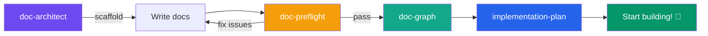
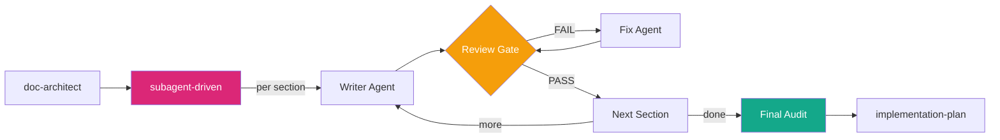

# RWANG (อาหวัง) — Document Intelligence System

A Claude Code plugin that brings SWE-standard documentation architecture, health checks, knowledge graphs, and implementation planning to any project.

## Commands & Tools

**13 total**: 7 slash commands (skills), 5 standalone scripts, 1 hook.

### Slash Commands (6 skills)

**🏗️ Setup & Scaffolding**

| Skill | Command | Description |
|-------|---------|-------------|
| **doc-architect** | `/rwang:doc-architect` | Analyze project → score templates → scaffold docs + Entity Registry + Edge Contracts + profile declaration |

**🔍 Validation & Audit**

| Skill | Command | Description |
|-------|---------|-------------|
| **doc-preflight** | `/rwang:doc-preflight` | 16-point health check: completeness, contradictions, staleness, contract coverage (#13), registry closure (#14), semantic-diff gate (#15), graph reconciliation (#16) |
| **rwang-self-audit** | `/rwang:rwang-self-audit` | Read-only self-audit: are this repo's docs, annotations, and graph current before a change/release |

**🕸️ Graph & Traceability**

| Skill | Command | Description |
|-------|---------|-------------|
| **doc-graph** | `/rwang:doc-graph` | Build/update the contract-bound document graph (schema 2.0.0, single writer), Change DAG, doc-code symlinks, exact-set reconciliation, traceability matrix |

**📋 Planning & Orchestration**

| Skill | Command | Description |
|-------|---------|-------------|
| **implementation-plan** | `/rwang:implementation-plan` | Generate phase-by-phase roadmap with sprints, risks, milestones (human-readable) |
| **exec-plan** | `/rwang:exec-plan` | Compose a machine-executable PlanEnvelope JSON — workstreams typed by one of 7 execution modes (Zuri-compatible), validated against the mode catalog, importable into an interactive UI |
| **subagent-driven** | `/rwang:subagent-driven` | Orchestrate multi-step doc work: fresh subagent per task, review gate, fast iteration |

### Standalone Scripts (CI/local — no AI required)

| Script | Purpose |
|--------|---------|
| `scripts/validate-graph.ps1 -Root <project>` | Core validator: contract validation + exact-set reconciliation, emits `RWG-*` findings as JSON; `-Mode hash` prints normalized contract hashes |
| `scripts/scan-annotations.ps1` / `.sh` | Annotation scanner: `@req/@spec/@designs/@tested` in code, `%% @req/@spec/@diagram_type/@id` in `.mmd`, frontmatter in `.test.md`, doc `id:` frontmatter |
| `scripts/validate-plan.ps1 -PlanPath <plan.json>` | Execution-plan preflight: closed vocabulary per mode, code integrity, schemaVersion 1.2 requirements — emits `PLN-1xx` findings (catalog: `references/execution-modes/`) |
| `scripts/bump-version.ps1 -Version X.Y.Z` | Sync plugin version across all harness manifests (release prep) |
| `scripts/drift-check.ps1` | Drift detector used by the PostToolUse hook (also runnable standalone) |

### Hook (1)

| Hook | Trigger | Behavior |
|------|---------|----------|
| drift-check | `PostToolUse` on Write/Edit | Warns when an edited file is tracked in the doc graph and may cause staleness (Windows-only, see Harness Support) |

## Recommended Workflow

```
Manual workflow:
1. /rwang:doc-architect    → Set up doc structure for your project
2. [Write your docs]       → Fill in the scaffolded templates
3. /rwang:doc-preflight    → Check for gaps and contradictions
4. /rwang:doc-graph        → Build the knowledge graph and traceability
5. /rwang:implementation-plan → Generate the development roadmap

Automated workflow (subagent-driven):
1. /rwang:doc-architect    → Set up doc structure
2. /rwang:subagent-driven  → Dispatch fresh subagent per section,
                              review gate after each, final audit
3. /rwang:implementation-plan → Generate the roadmap
```



### Subagent-Driven Mode



## Doc-Code Annotations

RWANG recognizes structured annotations in code comments:

```python
# @req FR-001, FR-002 — implements image generation pipeline
# @spec SDD-004 — agents use same pipeline API as UI
# @designs §5.5 — AI Agent Capabilities section
# @tested test_generation.py::test_create_generation
```

```typescript
// @req FR-001 — image generation endpoint
// @spec SDD-004 — same API surface for agents and UI
// @designs §5.5
// @tested __tests__/generation.test.ts
```

These annotations create bidirectional links in the document graph, enabling automatic traceability and drift detection.

## Document Templates

| Template | Best For |
|----------|----------|
| **Startup MVP** | ≤3 people, <50 files, no compliance |
| **3-Layer + Appendix** | 4-15 people, moderate complexity |
| **IEEE Full Split** | 15+ people, formal governance |
| **AI/ML Project** | Significant AI/ML components |
| **Regulated** | HIPAA / SOC2 / PCI / FDA compliance |
| **Microservices** | 3+ independent services |
| **Data Pipeline** | ETL-heavy, analytics platforms |

## Standards Supported

- **IEEE 29148-2018** — Systems and software engineering: Requirements
- **IEEE 1016-2009** — Software Design Description
- **ISO/IEC 42001** — AI Management System (for AI/ML projects)
- **IEEE 829-2008** — Software Test Plan (for IEEE Full Split)

## Git Hook

The plugin includes a drift-detection hook that warns when you edit code files tracked in the document graph:

```
[RWANG] Drift warning: 'backend/app/api/generations.py' is tracked in doc-graph.
[RWANG] Potentially affected docs: PRD-SDD-v2.0, API Reference
[RWANG] Run /rwang:doc-preflight to check for staleness.
```

## Scanner & Validator Quick Start

```powershell
# Scan annotations (PowerShell / Windows)
.\scripts\scan-annotations.ps1 -Path "D:\GPIC" -Format table

# Validate graph + registry (RWG-* findings, exit 1 on any finding)
.\scripts\validate-graph.ps1 -Root "D:\GPIC"
```

```bash
# Scan annotations (macOS/Linux/Git Bash)
./scripts/scan-annotations.sh /path/to/project table
```

## Installation

### Claude Code (marketplace — recommended)

This repo is a self-hosted plugin marketplace (`.claude-plugin/marketplace.json`):

```bash
/plugin marketplace add Freshair129/rwang-plugin
/plugin install rwang@rwang
```

**Updates are not automatic** for third-party marketplaces. Pull new versions with
`/plugin marketplace update rwang`, or enable auto-update in `/plugin` → Marketplaces.
The update signal is the `version` field in `.claude-plugin/plugin.json` — bumped on
every release by `scripts/bump-version.ps1`.

### Claude Code (local path)

```bash
claude plugin add ./rwang-plugin
```

### Codex

This repository also includes a Codex adapter at `.codex-plugin/plugin.json`. It exposes the
existing RWANG skills plus `rwang-self-audit`, a read-only workflow that checks the scanner and
reports whether a document graph is available. The Codex adapter has no automatic write, approval,
or promotion behavior.

### Other harnesses

Skills are plain `SKILL.md` folders and the schemas/scripts are harness-agnostic; each
release publishes a packaged `rwang-skills-v*.zip` for any runtime that consumes skill folders.

## Harness Support

| Harness | Mechanism | Status |
|---|---|---|
| Claude Code | `.claude-plugin/plugin.json` + marketplace.json + skills + hooks | ✅ Full (skills, drift hook, slash commands) |
| Codex | `.codex-plugin/plugin.json` adapter | ✅ Skills + self-audit (no hooks) |
| Any SKILL.md runtime (Copilot CLI, Gemini CLI, …) | `rwang-skills-v*.zip` release artifact | ⚙️ Skills/scripts only — no hook, no slash namespace |

Known limitation: the drift-check hook (`hooks/hooks.json`) invokes `powershell` and is
**Windows-only**; on macOS/Linux the hook fails silently. Scanner and validator scripts ship
in both `.ps1` and `.sh` where applicable.

## Release Automation

- `scripts/bump-version.ps1 -Version X.Y.Z` — syncs the version across every harness manifest (UTF-8-safe).
- `.github/workflows/ci.yml` — on every push/PR: JSON validation, cross-manifest version consistency, scanner + RWG validator test suites (Windows PowerShell 5.1), bash scanner smoke test.
- `.github/workflows/release.yml` — on tag `v*`: refuses mismatched tag/manifest versions, runs all tests, packages per-harness zips (`claude-plugin`, `codex-plugin`, `skills`), creates the GitHub Release.

Release procedure: `bump-version.ps1` → update `CHANGELOG.md` → commit → `git tag vX.Y.Z` → `git push --follow-tags`.

## Trust Hierarchy

When contradictions are detected between documents:

```
Code (what runs) > SDD (what was designed) > PRD (what was requested)
```

## File Structure

```
rwang-plugin/
├── .claude-plugin/
│   └── plugin.json              # Plugin manifest
├── skills/
│   ├── doc-architect/
│   │   └── SKILL.md             # Decision Engine skill
│   ├── doc-preflight/
│   │   └── SKILL.md             # Health check skill
│   ├── doc-graph/
│   │   └── SKILL.md             # Graph + DAG + symlinks skill
│   ├── implementation-plan/
│   │   └── SKILL.md             # Roadmap generation skill
│   └── subagent-driven/
│       └── SKILL.md             # Orchestrate via dispatch + review gate
├── hooks/
│   └── hooks.json               # PostToolUse drift detector
├── scripts/
│   ├── scan-annotations.ps1     # Annotation scanner (Windows)
│   ├── scan-annotations.sh      # Annotation scanner (Unix)
│   └── drift-check.ps1          # Drift detection hook script
├── docs/
│   ├── cr/                      # Change Requests catalog & proposals
│   ├── SPEC-5DRIVEN-INTEGRATION.md
│   └── CODEX-ADAPTER-SPEC.md
├── references/
│   ├── templates.json           # Template definitions & scoring rules
│   └── doc-graph-schema.json    # JSON Schema for .doc-graph.json
└── README.md                    # This file
```

## License

MIT
