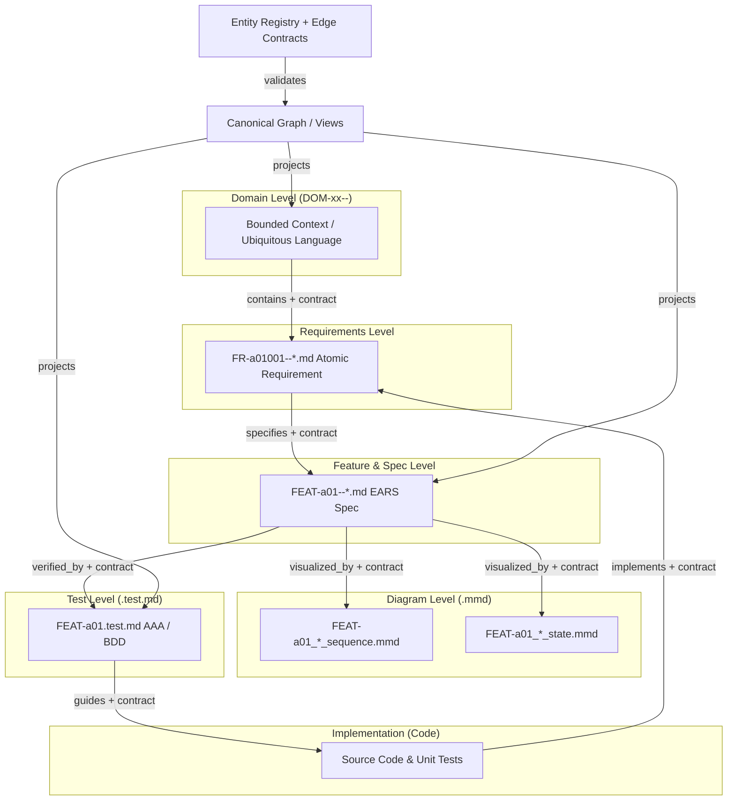

# Specification: 5-Driven SDLC Integration in RWANG

**Document ID:** `SPEC-5DRIVEN-01`
**Companion to:** [CR-2026-08-20-01](cr/CR-2026-08-20-01-diagram-test-and-5driven-traceability.md)
**Status:** DRAFT (A4 ALIGNED)
**Revision:** A4
**Last Updated:** 2026-08-20

---

## 1. Overview

This document details the technical implementation required to support **5-Driven Architecture** (Domain-Driven, Feature-Driven, Spec-Driven, Test-Driven, Diagram-Driven) across all RWANG skills and tools.

### 1.1 Definitions (normative, added in A2)

| Term | Meaning |
|---|---|
| **Driver** | A development paradigm a project chooses to practice (Domain-Driven, Test-Driven, …). Drivers shape which artifacts exist; they are not graph objects. |
| **View** | A projection lens over the canonical graph (Domain view, Verification view, Release view, …). A profile declares each view `required`, `optional`, or `not_applicable`. There is **no fixed standard number of views**. |
| **Artifact** | A concrete file on disk (`FEAT-a01--*.md`, `*.mmd`, `manifest.yaml`, source code). |
| **Canonical graph projection** | The generated `.doc-graph.json` + traceability outputs. Always derived, never hand-maintained, always reconciled against Registry/filesystem/manifests by stable ID. |



---

## 2. Directory Hierarchy Scanner Specification

When scanning a workspace, RWANG's scanner must identify the following pattern:

```text
docs/
├── ARCHITECTURE.md
├── DIAGRAM_GUIDELINES.md
├── registry/
│   ├── entity-types.yaml         # Entity TYPE registration (closed enum + ID namespaces)
│   ├── entities/
│   │   ├── domains/              # Canonical Domain registrations
│   │   ├── features/             # Canonical Feature registrations (parent_domain_id required)
│   │   └── releases/             # Release registrations (profile-gated)
│   └── edge-contracts/           # Versioned Edge Contracts — the ONLY location for Contract definitions
│       └── <predicate>@<semver>.yaml
├── domains/
│   └── DOM-{seq}--{domain_name}/
│       ├── README.md
│       ├── manifest.yaml         # Node manifest: identity + OUTGOING edge assertions (adapter-located, Core schema)
│       ├── requirements/
│       │   └── FR-{domain_seq}{feat_seq}{running_no}--{req_name}.md
│       ├── specs/
│       │   └── FEAT-{domain_seq}{feat_seq}--{feature_name}.md
│       ├── diagrams/
│       │   ├── FEAT-{domain_seq}{feat_seq}--{feature_name}_sequence.mmd
│       │   └── FEAT-{domain_seq}{feat_seq}--{feature_name}_state.mmd
│       └── tests/
│           └── FEAT-{domain_seq}{feat_seq}--{feature_name}.test.md
└── appendices/
    └── D-traceability.md
```

There is deliberately **no** `upstream.yaml` / `downstream.yaml` pair anywhere: one Edge is asserted from exactly one place (the from-side of the canonical direction). Upstream/inverse views are queries through the Graph Retrieval Layer, optionally materialized as clearly generated, never-hand-edited projections (e.g. `.upstream.gen.yaml`) that are never evidence sources.

### Regular Expressions for Entity Discovery

These patterns belong to the **`5-driven-domain` adapter**, not to RWANG Core. They are discovery hints only; entity membership is decided by the Registry and exact-set reconciliation (CR §2.3, §2.9).

| Entity | Pattern | Extracted Groups |
|---|---|---|
| Domain Folder | `^DOM-(?P<seq>[0-9]{2}|[a-z])--(?P<name>[a-z0-9_-]+)$` | `seq`, `name` |
| Requirement Doc | `^FR-(?P<domain>[a-z])(?P<feat>[0-9]{2})(?P<id>[0-9]{3})--(?P<name>[a-z0-9_-]+)\.md$` | `domain`, `feat`, `id`, `name` |
| Feature Spec | `^FEAT-(?P<domain>[a-z])(?P<feat>[0-9]{2})--(?P<name>[a-z0-9_-]+)\.md$` | `domain`, `feat`, `name` |
| Diagram File | `^FEAT-(?P<domain>[a-z])(?P<feat>[0-9]{2})--(?P<name>[a-z0-9_-]+)_(?P<diag_type>sequence\|state\|component)\.mmd$` | `domain`, `feat`, `name`, `diag_type` |
| Test Spec | `^FEAT-(?P<domain>[a-z])(?P<feat>[0-9]{2})--(?P<name>[a-z0-9_-]+)\.test\.md$` | `domain`, `feat`, `name` |

---

### 2.1 Registry and identity rules

The filename pattern is a discovery hint, not the canonical identity source. Each Domain and Feature MUST have a Registry entry with a stable ID, canonical path, lifecycle `status` (`draft` | `active` | `deprecated` | `superseded`), `introduced_by` (provenance object, §2.5), and parent relationship. A Feature MUST reference `parent_domain_id` explicitly; the scanner MUST NOT infer Domain membership only from a letter or sequence position.

Requirement, Diagram, and Test Spec instances register **inside their owning Feature's entry** (nested registration, CR §2.3.2) unless the profile promotes them to first-class registry directories.

**ID namespaces and aliasing:** requirement IDs are namespaced (`req:prd:FR-001`, `req:dom:FR-b01001`). When the same real-world entity exists in two namespaces, the adapter MUST declare either an alias mapping (one registry entry) or two entities joined by an explicit `refines` Edge. Unlinked duplicate identities fail reconciliation.

**Rename, alias, and prefix-collision rules (A3):**

1. **Folder/file renames are adapter path-convention changes.** The stable ID does not change; only `canonical_path` is updated (with provenance). Example: renaming `DOM-01--playback/` to `DOM-a--playback/` keeps `dom:DOM-01` — the domain letter used inside `FR-a01001`/`FEAT-a01` IDs is a display/naming convention; domain membership always comes from `parent_domain_id` in the Registry, never from parsing the letter.
2. **Changing a stable ID is a migration**, not a rename: the new entry declares the old ID in `aliases`, and the migration is recorded in provenance.
3. **Aliases must not collide** with any registered `entity_id` or another entity's alias (`RWG-106`).
4. **`canonical_path` is unique per entity** — two entities claiming one path fail `RWG-106`.
5. **Prefix-ambiguity is rejected in name-based namespaces** (`dom:`, `feat:`, `req:`, `rel:`): no registered ID (or alias) may be a strict prefix of another (e.g. `dom:DOM-01` vs `dom:DOM-011`), because unbounded patterns cannot disambiguate them (`RWG-106`). Path-based namespaces (`diag:`, `testspec:`, `code:`) are exempt. Adapters must additionally use bounded discovery patterns so `FR-001` never matches inside `FR-a01001`.
6. **Alias resolution boundary:** adapter-facing inputs (discovery output, traceability input) MAY reference aliases — Core resolves them to primary IDs during reconciliation. The canonical graph projection itself MUST contain primary IDs only; an alias appearing as a graph node fails `RWG-104`.

### 2.1.1 Filename convention modes (A4)

The filename convention is adapter-owned; the profile declares one of two modes (`filename_convention` in the profile manifest):

**Mode `id-prefixed`** (legacy default): `<ID>--<name>.md`, e.g. `FEAT-a01--queue_management.md`. Identity is parsed from the filename as a discovery hint; the Registry remains authoritative.

**Mode `name-only`** (recommended for new projects): the filename carries only the human name — `queue_management.md`. Identity travels **inside the file**:

| Artifact | In-file identity declaration |
|---|---|
| `.md` (spec, requirement, any governed doc) | frontmatter `id: FEAT-a01` |
| `.mmd` | `%% @id FEAT-a01:sequence` |
| `.test.md` | frontmatter `id: FEAT-a01:test01` (optional; `spec:` binding often suffices) |

Rules for `name-only` mode:

1. **Binding precedence:** Registry `canonical_path` > in-file `id` > path inference. A file whose in-file `id` conflicts with the Registry entry that claims its path fails `RWG-109 IDENTITY_BINDING_MISMATCH`; likewise a discovery entry whose path disagrees with the registered `canonical_path` for that ID.
2. **Renames are trivial:** renaming `queue_management.md` → `playlist_management.md` changes `canonical_path` (+ `label`) only; the in-file `id` keeps the binding intact through the rename, and reconciliation flags any missed registry update loudly (`RWG-102`/`RWG-101`) instead of silently rebinding.
3. **Display name is data, not identity:** the registry entry carries `label` (e.g. `queue_management`); labels may change freely, IDs may not.
4. **Diagram/test-spec IDs become feature-scoped, not path-based:** `diag:FEAT-a01:sequence`, `testspec:FEAT-a01:acceptance` — path changes never churn identity. (Path-based `diag:<path>` IDs remain valid for `id-prefixed` projects.)
5. **ID semantics are mnemonic only:** `FEAT-a01` reads as *[type]-[domain-letter][running number]* — "feature 01 under domain a" — but the letter is a human mnemonic. Authoritative domain membership is ALWAYS `parent_domain_id` in the Registry. A feature that later moves to another domain keeps its ID (the letter goes stale as a mnemonic, which is acceptable) or migrates to a new ID with an alias — the scanner MUST NOT infer or enforce membership from the letter.

The Registry is closed-world by default:

- unknown Entity types, IDs, fields, or predicates fail validation;
- new Entity types require a schema/profile change registered in `entity-types.yaml`;
- new Entity instances require a Registry entry;
- generated graph and traceability files are projections, not independently edited sources.

### 2.2 Canonical Contract-Bound graph model

Nodes hold intrinsic facts. Edges hold relationships and communication contracts. Every Edge MUST include `contract_id`, `contract_version`, `semantic_hash`, and source evidence. Every Edge instance has exactly one from-side assertion source (annotation, frontmatter, or node manifest); generated artifacts are never assertion sources.

| From | Predicate | To | Contract requirement |
|---|---|---|---|
| `domain` | `contains` | `feature` / `requirement` | Domain ownership and cardinality |
| `document` / `section` | `defines` | `requirement` / `feature` | Where the entity's text is defined (replaces legacy doc→req `specifies`) |
| `requirement` | `specifies` | `feature` | Requirement-to-feature refinement — the only meaning of `specifies` |
| `feature` | `visualized_by` | `diagram` | Diagram type and feature identity; Core cardinality `0..*` — requiredness (`1..*`) is declared by the profile, not the Contract |
| `feature` / `requirement` | `verified_by` | `test_spec` | Test type and coverage target |
| `code_file` | `implements` | `requirement` / `feature` | Code annotation and provenance; **`code_file` sources only** |
| `test` | `verifies` | `requirement` | Executable test evidence |
| `test` | `tests` | `code_file` | Executable test evidence |
| `test_spec` | `guides` | `code_file` | Test-spec guidance when enabled by the profile (unit tests are `code_file`/`test` nodes; `guides` never targets `test`) |
| `requirement` | `refines` | `requirement` | Cross-namespace refinement (alias alternative, §2.1) |
| `document` | `supersedes` | `document` | Newer supersedes older; dual labels, consistency rules (CR §2.6) |
| `document` / `feature` / `requirement` | `applies_to` | `release` | Release binding, profile-gated (CR §2.7) |
| any | `contradicts` | any | Diagnostic class: `reason` + provenance required, no semantic contract |

`stale` is **not** a predicate (removed in graph schema 2.0.0): staleness is `status: "stale"` + `reason` on the underlying semantic Edge. Inverse navigation MUST query the same Edge. It MUST NOT create a second reverse Edge with different semantics.

Example Contract shape (field names normative — `contract_version`, not `version`):

```json
{
  "contract_id": "edge:feature_visualized_by_diagram",
  "contract_version": "1.0.0",
  "from_type": "feature",
  "to_type": "diagram",
  "predicate": "visualized_by",
  "labels": { "forward": "visualized by", "inverse": "visualizes (query only)" },
  "payload_schema": {},
  "cardinality": "0..*",
  "semantic_hash": "sha256:<normalized-contract>",
  "status": "approved",
  "provenance": {
    "actor_type": "human",
    "actor_id": "boss",
    "tool": "rwang:doc-architect",
    "tool_version": "1.1.0",
    "timestamp": "2026-08-20T00:00:00Z",
    "source_ref": "<commit-sha>",
    "approval_ref": "CR-2026-08-20-01#A2"
  }
}
```

### 2.3 Semantic-diff contract

Before publishing a graph, RWANG normalizes every Contract and compares its semantic hash with the previous approved version.

**Normalization algorithm (normative):**
1. Parse the Contract to a canonical object model.
2. Drop non-semantic fields: `labels`, `provenance`, comments, and descriptive metadata.
3. Sort all object keys lexicographically; normalize whitespace; lower-case predicate and type names.
4. Serialize as canonical JSON (UTF-8, no insignificant whitespace) and hash with SHA-256.

`edge.semantic_hash` on every Edge instance is the hash of the normalized Contract *version the Edge was validated against* — not a hash of the Edge payload.

Change classification:

- Breaking changes: endpoint types, direction, predicate meaning, required fields, cardinality, or ID namespace.
- Additive changes: optional fields or non-breaking profile metadata.
- Descriptive changes: labels and comments only (excluded from the hash, so they never trip the gate).

Breaking changes require a new Contract version and migration evidence. Raw text diff alone is not sufficient to establish semantic equivalence. Additionally, a governed document whose content hash changes without a `doc_version` bump fails `RWG-108 UNVERSIONED_DOC_CHANGE`.

### 2.4 Adapter contract, Hybrid IR, and Retrieval/Query layers

RWANG Core owns: ontology and canonical predicates, Contract validation, Registry closure, semantic diff, reconciliation and error codes (CR §2.9), stale propagation, the graph schema, the profile manifest schema, the node-manifest schema, the **Hybrid IR** schema, the **Graph Retrieval Layer**, and the **Typed Query IR**.

A project adapter owns only: local path conventions and discovery globs, parsers, ID aliases/equivalences, manifest file locations, complexity keyword lists (Check #11), the trust-hierarchy declaration, and profile requiredness. An adapter MUST NOT invent Entity types, predicates, or fields during scanning.

**Write path (Hybrid IR):** adapter → normalized IR (closed schema: entity claims + edge claims + provenance) → Core validation against Registry/Contracts → graph projection. Adapters never write the graph.

**Read path:** all consumers (preflight, traceability generation, agents) read through the Graph Retrieval Layer; nothing reads `.doc-graph.json` directly. Inverse navigation is implemented here over the single stored Edge.

**Typed Query IR:** a query declares predicate and endpoint types and is validated against the same ontology as edges — unknown predicates fail exactly like invalid edges. A view a profile declares `not_applicable` answers **"declared absent"**, distinct from an empty result; reports MUST NOT render "declared absent" as coverage.

### 2.5 Provenance object

All `introduced_by` / `owner` / graph-header provenance uses the structured object defined in CR §2.5. Rules restated: provenance is audit metadata — `session_id`, `actor_id`, `run_id`, `timestamp` never enter `semantic_hash` or reconciliation; agent-actor Registry/Contract mutations require `approval_ref` (`RWG-107` otherwise); every published graph carries `source_ref` (commit SHA, or content-digest of the discovery set in no-VCS mode) and has a single writer (`rwang:doc-graph`).

---

## 3. Preflight Health Check Rules (Additions)

RWANG `doc-preflight` should implement the following checks when this structure is detected:

### Check #11: `visual-model-coverage`
- **Condition:** For every `FEAT-*.md` matching the **profile-configured complexity heuristics** (e.g. the `5-driven-domain` default keyword set: `ws`, `emit`, `broadcast`, `buffer`, `timeout`, `session` — configurable per adapter, never hard-coded in Core), check if a corresponding `_sequence.mmd` or `_state.mmd` exists in `diagrams/`.
- **Severity:** WARNING
- **Remediation:** Report the gap; scaffold a boilerplate Mermaid file from `DIAGRAM_GUIDELINES.md` templates **only when the user explicitly authorizes document generation**.

### Check #12: `test-spec-coverage`
- **Condition:** For every `FR-*.md` requirement, check for at least one accepted verification source. The active profile decides whether `.test.md`, automated tests, or both are required.
- **Severity:** WARNING
- **Remediation:** Report the missing verification source and scaffold a test specification only when the user authorizes document generation.

### Check #13: `edge-contract-coverage`
- **Condition:** Every graph Edge has a registered Contract, valid endpoint types, canonical predicate, matching `contract_version` and `semantic_hash`, and exactly one from-side assertion source. Applies equally to `source: manual` edges.
- **Severity:** CRITICAL — maps to `RWG-201..204`, `RWG-206..209`
- **Remediation:** Register or select the correct Contract and fix the assertion source; do not create a direct node reference.

### Check #14: `entity-registry-closure`
- **Condition:** Every discovered or referenced Entity is registered, every active Registry entry has a valid source projection, and every agent-actor Registry mutation carries `approval_ref`.
- **Severity:** CRITICAL — maps to `RWG-101`, `RWG-102`, `RWG-107`
- **Remediation:** Register the Entity or explicitly deprecate/remove the Registry entry with provenance.

### Check #15: `semantic-diff-gate`
- **Condition:** A breaking Contract change has a new version and migration evidence; governed document changes carry a `doc_version` bump.
- **Severity:** CRITICAL — maps to `RWG-205`, `RWG-108`
- **Remediation:** Create a versioned Contract migration / bump `doc_version`, or restore the previous approved state.

### Check #16: `graph-source-reconciliation`
- **Condition:** Registry, filesystem discovery, manifest assertions, graph nodes, and traceability outputs have equal stable-ID sets for the active profile, and the graph header `source_ref` matches the current checkout (content-digest in no-VCS mode).
- **Severity:** CRITICAL — maps to `RWG-103..106`
- **Remediation:** Regenerate projections from the merged checkout and report missing, orphaned, duplicate, or unregistered Entities.

### Trust hierarchy (profile-owned)

The contradiction-resolution order is a **profile declaration**, not a Core constant. Default: `Code > SDD > PRD`. A diagram-first or test-first profile (e.g. `5-driven-domain`) MAY declare e.g. `Test Spec > Diagram > Spec > Code` for pre-implementation phases. Core executes whatever hierarchy the active profile declares and always names the winning source in findings.

---

## 4. Adapter and View Profiles

The graph core is shared, but projects select view profiles. Every profile MUST declare all three columns; absence is never silently interpreted — an undeclared view in a strict-mode project is a preflight failure, and `optional` means "if present, it must be fully valid", never "ignorable".

| Profile | Required views | Optional views | not_applicable views |
|---|---|---|---|
| `5-driven-domain` | Domain, Requirement, Feature, Diagram, Verification | Implementation, Operations, Release | — |
| `flat-prd-sdd` | Requirement, Design, Verification | Diagram, Release | Domain, Feature |
| `ieee-full` | Requirement, Design, Test, Architecture | Diagram, Operations, Release | Domain, Feature |
| `microservices` | Requirement, Design, Implementation, Operations (per service) | Diagram, Test-spec, Release | Domain*, Feature |

\* A microservices project MAY alternatively map its service boundaries onto the Domain view instead of declaring it `not_applicable`; the profile manifest records which mapping is chosen.

A profile MUST explicitly mark unsupported views as `not_applicable`; a `not_applicable` view answers "declared absent" to Typed Queries and is excluded from coverage denominators. Each profile also declares its trust hierarchy (§3) and its Check #11 heuristics.

Agents implement or configure adapters against this contract. They do not implement separate graph semantics per project.

## 5. Verification Scenarios

The normative acceptance test matrix is CR §7 (T1–T21). Summary of the load-bearing scenarios:

1. A branch adds a sixth Domain but does not update the graph. Reconciliation MUST fail (`RWG-103`) until the Registry and generated graph are regenerated from the merged checkout. (T1; duplicate-ID merge collisions → T2/`RWG-106`.)
2. A Feature directory exists without a Registry entry. `entity-registry-closure` MUST fail (`RWG-101`). (T3)
3. An Edge contains an unknown predicate, lacks a Contract, or has `implements` sourced from a document node. `edge-contract-coverage` MUST fail (`RWG-201/202/203`). (T5, T10, T11)
4. A Contract changes direction or required fields without a new version. `semantic-diff-gate` MUST fail (`RWG-205`); an unversioned governed-doc change fails `RWG-108`. (T6)
5. A flat PRD/SDD project with no Domain view passes only when its profile declares Domain and Feature as `not_applicable`; without the declaration it fails. (T8, T9)
6. Supersession: one `supersedes` Edge serves both readings ("A superseded_by B", "B delivered/derived from A"); a hand-made reverse Edge fails `RWG-206`. (T17, T18)
7. Manifests: duplicate or to-side assertions fail `RWG-208`; stale contract references fail `RWG-209`; hand-edited generated projections are detected. (T19–T21)
8. Provenance: agent mutations without `approval_ref` fail `RWG-107`; regenerating from another session reconciles identically. (T13, T14)

---

## Appendix A — Normative Schema Stubs (to be extracted to `references/` before implementation)

### A.1 Entity registry entry (`entity-registry-schema`)

```yaml
entity_id: string            # required, matches the registered ID namespace
entity_type: string          # required, must exist in entity-types.yaml
canonical_path: string       # required
parent_domain_id: string     # required for features
status: draft | active | deprecated | superseded
doc_version: string          # semver, for document-backed entities
nested:                      # nested registrations (requirements/diagrams/test specs) per CR §2.3.2
  requirements: [ { id, path } ]
  diagrams:     [ { id, path, diagram_type } ]
  test_specs:   [ { id, path, test_type } ]
aliases: [ string ]          # equivalent IDs in other namespaces (CR §2.3.4)
introduced_by: <provenance object>   # CR §2.5
```

### A.2 Edge contract (`edge-contract-schema`)

```yaml
contract_id: string          # "edge:<from>_<predicate>_<to>"
contract_version: string     # semver — the only version field name
predicate: string            # canonical set only
from_type: [ string ]
to_type: [ string ]
labels: { forward: string, inverse: string }   # display only, excluded from semantic_hash
payload_schema: object       # JSON Schema for edge payload, may be empty
cardinality: string          # structural bound; requiredness lives in the profile
status: proposed | approved | deprecated
semantic_hash: string        # sha256 of normalized contract (SPEC §2.3)
provenance: <provenance object>
```

### A.3 Profile manifest (`profile-schema`)

```yaml
profile_id: string
views:
  required: [ string ]
  optional: [ string ]         # if present, must be fully valid
  not_applicable: [ string ]   # answers "declared absent"
trust_hierarchy: [ string ]    # ordered, e.g. [code, sdd, prd]
check_config:
  visual_model_keywords: [ string ]   # Check #11 heuristics
  verification_sources: [ test_md, automated, both ]
edge_gates:
  guides: enabled | disabled
  applies_to: enabled | disabled
requiredness:                  # per-predicate minimums layered over Core cardinality
  visualized_by: "1..*"        # example: 5-driven-domain requires diagrams for complex features
```

### A.4 Node manifest (`node-manifest-schema`, location adapter-defined)

```yaml
entity_id: string
entity_type: string
doc_version: string
edges:                        # OUTGOING assertions only; inverse is a query
  - predicate: string
    to: string
    contract_id: string
    contract_version: string
    payload: object           # optional, validated against payload_schema
```

## Appendix B — Revision History

| Revision | Date | Summary |
|---|---|---|
| A1 | 2026-08-20 | Initial draft aligned with CR A1. |
| A4 | 2026-08-20 | Filename convention modes (§2.1.1): `id-prefixed` vs `name-only` (`queue_management.md` + in-file `id:` frontmatter / `%% @id`); binding precedence + `RWG-109`; `label` field; feature-scoped diagram/test-spec IDs; ID letters are mnemonic, `parent_domain_id` authoritative. Implemented in plugin v1.2.0. |
| A3 | 2026-08-20 | Rename/alias/prefix-collision rules in §2.1: renames update `canonical_path` only; ID changes require aliases; alias/path/prefix collisions fail `RWG-106`; alias resolution for adapter inputs, primary-ID-only graphs. Implemented in plugin v1.1.1. |
| A2 | 2026-08-20 | Aligned with CR A2: Definitions (Driver/View/Artifact/Projection); registry tree with `entity-types.yaml`, `releases/`, node manifests, and no upstream/downstream pairs; regex table marked adapter-owned; nested registration, lifecycle status, ID aliasing; canonical edge table with `defines`/`refines`/`supersedes`/`applies_to`, `implements` restricted to `code_file`, `guides` endpoint fixed, `stale` removed; contract example fixed (`contract_version`, `labels`, `provenance`, cardinality `0..*`); semantic-hash normalization algorithm; Hybrid IR / Retrieval Layer / Typed Query IR; profile table with `not_applicable` column + `microservices` profile; profile-owned trust hierarchy and Check #11 heuristics; checks mapped to `RWG-*` codes; verification scenarios keyed to CR test matrix T1–T21; normative schema stubs (Appendix A). |
