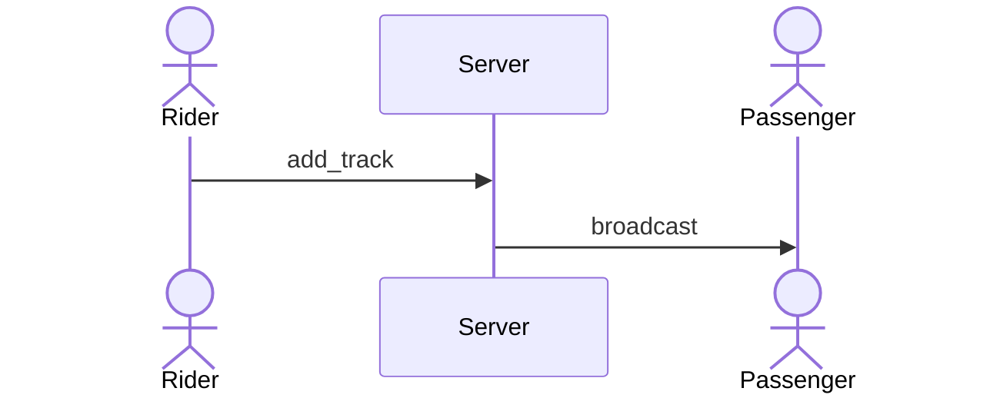

# Change Request: CR-2026-08-20-01

**Title:** Native Support for Diagram-Driven (`.mmd`), Test-Driven (`.test.md`), and 5-Driven Domain Prefixes in RWANG Knowledge Graph & Preflight
**Author:** AI System Architect / Antigravity Pair
**Status:** APPROVED (A2 — implemented in RWANG 1.1.0)
**Target Version:** RWANG 1.1.0
**Created:** 2026-08-20
**Last Updated:** 2026-08-20
**Revision:** A2
**Category:** Enhancement / Feature Specification

---

## 1. Executive Summary & Problem Statement

### 1.1 Context
In modern software development and specification architectures (specifically **5-Driven Architecture**: Domain-Driven, Feature-Driven, Spec-Driven, Test-Driven, Diagram-Driven), documentation is not limited to monolithic markdown text. Projects organize assets into structured domains (e.g. `DOM-01--playback/`) containing:
- Atomic Requirements (`FR-a01001--*.md`)
- Technical Feature Specs (`FEAT-a01--*.md`)
- Visual State & Sequence Models in Mermaid (`*.mmd`)
- Pre-Implementation Acceptance & TDD Test Specs (`*.test.md`)

### 1.2 The Problem in RWANG 1.0.0
1. **Diagram Invisibility (Dark Assets):** RWANG's `doc-graph` scanner currently only indexes `.md` files and code source files. Mermaid diagram files (`.mmd`) in `diagrams/` folders are ignored.
2. **Missing Node & Edge Types in Schema:** `references/doc-graph-schema.json` lacks explicit node types for visual models (`diagram`) and test specification documents (`test_spec`), as well as relationship edges (`visualizes`, `specifies_test`).
3. **No Drift Detection for Diagrams:** If an underlying requirement (`FR-xxx`) or feature spec changes, `doc-preflight` and Git hooks cannot notify the developer that the corresponding Sequence or State diagram is now stale.
4. **Domain Prefix Parsing:** RWANG scanner assumes standard flat paths (`docs/`, `src/`) and does not natively parse or leverage structured prefix hierarchies (`DOM-xx--`, `FEAT-xx--`, `FR-xxxxxx--`).

### 1.3 Observed Failure Evidence (added in A2)

An independent review of a real generated graph (BikeOps, `.doc-graph.json`, 2026-08-19) confirmed three compounding false-green mechanisms that this CR MUST close:

1. **Vacuous truth:** the ontology cannot represent Domain/Feature/Diagram/TestSpec, so a graph with 0 domain nodes passes every check while the filesystem holds 6 domains, 14 `.mmd` and 7 `.test.md` files.
2. **Circular evidence:** `implements` edges were emitted from *documents* to requirements — including from the auto-generated traceability matrix itself — so every requirement appeared implemented with zero code files in the graph.
3. **Stale committed projection:** the graph is an incrementally-updated committed file with no record of which checkout produced it; a branch merge unions source documents but not the graph, and no set-level check exists to catch the divergence before publication.

Consequences: `implements` MUST be restricted to `code_file` sources, generated artifacts MUST NOT count as evidence, and every published graph MUST carry a `source_ref` and pass exact-set reconciliation.

---

## 2. Proposed Specification & Schema Changes

### 2.1 JSON Schema Extensions (`references/doc-graph-schema.json`)

#### A. Node Types Addition
Add `domain`, `feature`, `diagram`, `test_spec`, and `release` to the `nodes[].type` enum:
```json
  "type": {
  "type": "string",
  "enum": [
    "document",
    "section",
    "requirement",
    "domain",
    "feature",
    "code_file",
    "component",
    "test",
    "test_spec",
    "diagram",
    "api_endpoint",
    "db_table",
    "release"
  ]
}
```

* Node ID Format for Domains: `dom:<DOM-ID>` (e.g. `dom:DOM-01`)
* Node ID Format for Features: `feat:<FEAT-ID>` (e.g. `feat:FEAT-a01`)
* Node ID Format for Diagrams: `diag:<path_to_mmd>` (e.g. `diag:docs/domains/DOM-01--playback/diagrams/FEAT-a01--queue_management_sequence.mmd`)
* Node ID Format for Test Specs: `testspec:<path_to_test_md>` (e.g. `testspec:docs/domains/DOM-01--playback/tests/FEAT-a01--queue_management.test.md`)
* Node ID Format for Releases: `rel:<product>@<semver>` (e.g. `rel:bikeops@2.3.0`) — profile-gated, see §2.7
* Requirement IDs are namespaced: `req:<namespace>:<ID>` (e.g. `req:prd:FR-001`, `req:dom:FR-b01001`). See §2.3.4 for the alias/equivalence rule.

**BREAKING (declared explicitly in A2):** the node `id` regex pattern changes from `^(doc|sec|req|code|comp|test|api|db):.+` to include `dom|feat|diag|testspec|rel` prefixes. This is a breaking schema change and requires the graph schema version to bump to **2.0.0**.

#### B. Edge Types Addition and Removal
The full canonical predicate set added by this CR is: `contains`, `defines`, `guides`, `visualized_by`, `verified_by`, `refines`, `supersedes`, `applies_to`. (A1 called out only `visualized_by`/`verified_by` while its enum snippet silently included `contains`/`guides`; A2 declares every addition explicitly.) The earlier `visualizes` and `specifies_test` names are provisional aliases and MUST NOT be emitted by the graph generator.

**BREAKING removal:** `stale` is removed from the predicate enum. Staleness is a *state*, not a relationship: it is expressed as `status: "stale"` (+ `reason`) on the existing semantic edge. A `stale` edge between arbitrary node types is inherently uncontracted and violates the Contract model. Legacy graphs containing `stale` edges remain readable in `legacy` mode only.

```json
"type": {
  "type": "string",
  "enum": [
    "specifies",
    "defines",
    "contains",
    "implements",
    "designs",
    "tests",
    "verifies",
    "depends_on",
    "references",
    "exposes",
    "persists_to",
    "contradicts",
    "guides",
    "visualized_by",
    "verified_by",
    "refines",
    "supersedes",
    "applies_to"
  ]
}
```

Canonical directions (normative; full endpoint table in SPEC §2.2):

* `contains`: `domain` → `feature` / `requirement`
* `defines`: `document` / `section` → `requirement` / `feature` — where the entity's text is defined (replaces the misused doc→req `specifies`)
* `specifies`: `requirement` → `feature` — refinement, this is the **only** meaning of `specifies`
* `visualized_by`: `feature` → `diagram`
* `verified_by`: `feature` / `requirement` → `test_spec`
* `implements`: `code_file` → `requirement` / `feature` — **`code_file` sources only**; documents, sections, and generated artifacts MUST NOT be `implements` sources
* `guides`: `test_spec` → `code_file` (when the profile models test-spec guidance)
* `refines`: `requirement` → `requirement` — cross-namespace refinement (e.g. `req:prd:FR-001` → `req:dom:FR-b01001`)
* `supersedes`: `document` (newer) → `document` (older) — see §2.6
* `applies_to`: `document` / `feature` / `requirement` → `release` — profile-gated, see §2.7
* `contradicts`: diagnostic edge class — any → any, requires `reason` + provenance but no semantic contract
* **Reserved (not active):** `derived_from` (`document` → `document`) for lineage-without-replacement; activating it requires a Contract, Registry support, migration notes, and acceptance tests per §2.3.
* Inverse navigation is a query over the same directed Edge, not a second reverse Edge.

### 2.2 Contract-Bound Graph Boundary

All cross-node communication or semantic relationships MUST be represented by a typed, directed Edge backed by a versioned Contract. Communication here means graph data flow or semantic linkage; it does not require runtime process-to-process messaging.

- Nodes contain intrinsic identity and intrinsic facts only.
- Relationship meaning, payload, cardinality, provenance, and change state belong to the Edge.
- Every Edge MUST contain `contract_id`, `contract_version`, and `semantic_hash`.
- A node MUST NOT read or write another node's fields through an undeclared direct reference.
- An inverse traversal is a graph query over the same Edge; it MUST NOT create a second, conflicting reverse Edge.
- Unknown predicates, endpoint types, payload fields, or contract versions MUST fail validation rather than being silently accepted.
- **Evidence rule (A2):** generated projections (`.doc-graph.json`, traceability matrices, `.upstream.gen.*` files) MUST NOT be the source of any semantic Edge assertion. An Edge whose only evidence is a generated artifact fails validation.
- **Single-assertion rule (A2):** each Edge instance is asserted from exactly one source location on the *from* side of its canonical direction (annotation, frontmatter, or node manifest — see §2.3.5). Duplicate assertions or assertions from the *to* side fail validation.

Minimum Contract fields (field names are normative; `version` alone is not acceptable):

| Field | Purpose |
|---|---|
| `contract_id` | Stable identity of the Edge contract |
| `contract_version` | Compatibility and migration boundary (semver) |
| `from_type` / `to_type` | Allowed endpoint node types |
| `predicate` | Canonical relationship meaning and direction |
| `labels` | Optional display labels: `forward` and `inverse` reading of the same Edge |
| `payload_schema` | Allowed relationship data, if any |
| `cardinality` | Relationship multiplicity constraint (Core cardinality is structural; *requiredness* belongs to profiles) |
| `semantic_hash` | Hash of the normalized Contract content (see §2.4) |
| `status` | Governance and approval state |
| `provenance` | Structured provenance object (see §2.5) |

**`semantic_hash` definition (A2):** `edge.semantic_hash` is the hash of the *normalized Contract version* the Edge was validated against — not a hash of the Edge payload. The normalization algorithm (key ordering, whitespace, comment stripping, label exclusion) is defined normatively in SPEC §2.3. Provenance fields are excluded from the hash input (see §2.5).

### 2.3 Closed-World Entity Registry

RWANG MUST use a canonical Entity Registry for Domain, Feature, Requirement, Diagram, Test Spec, Code, Release, and project-specific extensions.

- A new entity type MUST be registered before it can appear in the graph.
- A new entity instance MUST use a registered ID namespace and a registry entry.
- A new Edge predicate or payload field MUST be introduced through a Contract change, not invented by an adapter or agent during scanning.
- The generated graph is a projection of the Registry plus discovered source artifacts; it is not a second source of truth.
- Reconciliation MUST compare `registry ↔ filesystem ↔ manifest assertions ↔ graph ↔ traceability outputs` by stable ID, not by a hard-coded count or filename list. Glob/filename patterns are discovery hints only; set membership is decided by the Registry and exact-set reconciliation.
- Existing projects MAY run in explicit `legacy` migration mode, but strict mode MUST reject unregistered entities and uncontracted Edges.

#### 2.3.1 Registry layout completeness (A2)

The closed-world claim is only enforceable if every governed entity type has a registration home:

```text
docs/registry/
├── entity-types.yaml            # Entity TYPE registration (closed enum + ID namespace per type)
├── edge-contracts/              # Versioned Contract definitions — the ONLY location for Contract definitions
│   └── <predicate>@<semver>.yaml
└── entities/
    ├── domains/                 # One entry per Domain
    ├── features/                # One entry per Feature (with parent_domain_id)
    └── releases/                # One entry per Release (profile-gated)
```

#### 2.3.2 Nested registration rule (A2)

Requirement, Diagram, and Test Spec instances are registered **inside their owning Feature's registry entry** (canonical paths + stable IDs listed per Feature); Code files are registered implicitly through validated annotations plus the Feature/Requirement they reference. A project MAY promote any of these to first-class registry directories via its profile, but the default keeps the registry proportional to governance value.

#### 2.3.3 Registry entry required fields (A2)

Every registry entry MUST carry: stable ID, entity type, canonical path, `parent_domain_id` (for Features), lifecycle `status` (`draft` | `active` | `deprecated` | `superseded`), and `introduced_by` (a provenance object per §2.5). Lifecycle `status: draft` allows a Domain/Feature to exist with incomplete required views during staged rollout without disabling gates for the rest of the project.

#### 2.3.4 ID alias / equivalence rule (A2)

When the same real-world entity has identities in more than one namespace (e.g. a flat PRD `req:prd:FR-001` and an atomic 5-driven `req:dom:FR-b01001`), the adapter MUST declare one of:
1. an **alias mapping** (both IDs resolve to one registry entry), or
2. **distinct entities** connected by an explicit `refines` Edge.

Two unlinked namespaces for the same requirement concept fail reconciliation (`RWG-106` or `RWG-105` depending on where the divergence appears).

#### 2.3.5 Node manifests — Edge assertion at the node (A2)

Contract *definitions* are centralized (§2.3.1) and MUST NOT be duplicated per node. Contract *usage* MAY be declared next to the node via a **node manifest** (e.g. `DOM-01--playback/manifest.yaml`):

- A manifest declares the entity's identity, `doc_version`, and its **outgoing** Edge assertions only, each referencing a central `contract_id` + `contract_version`.
- There is **no** `upstream.yaml`/`downstream.yaml` pair: an "upstream" view is an inverse query through the Graph Retrieval Layer, optionally materialized as a clearly-marked generated projection (e.g. `.upstream.gen.yaml`) that is never hand-edited and never an evidence source.
- The manifest **schema** is owned by RWANG Core (it is part of the Hybrid IR, §2.8); the manifest's filename and location convention is owned by the adapter.
- Manifest assertions join the exact-set reconciliation as their own set.

### 2.4 Semantic-Diff Gate

Graph generation and preflight MUST classify Contract changes:

- Breaking: endpoint type, Edge direction, predicate meaning, required field, cardinality, or ID namespace changes.
- Additive: optional payload fields or non-breaking profile metadata.
- Descriptive: labels, comments, or documentation-only changes.

Breaking semantic changes MUST require a new Contract version and migration evidence. Raw text similarity MUST NOT be used as a substitute for semantic validation.

**Document version gate (A2):** every governed document node carries machine-readable `doc_version` and `doc_status` (see §2.6). A content-hash change on a governed document without a `doc_version` bump fails preflight (`RWG-108 UNVERSIONED_DOC_CHANGE`).

### 2.5 Provenance Object (A2)

`owner`/`introduced_by`/`source` fields across the Registry, Edges, and graph header all use one structured object:

```json
"provenance": {
  "actor_type": "agent | human | ci",
  "actor_id": "<model id, git author, or pipeline id>",
  "session_id": "<opaque harness session id, optional>",
  "run_id": "<subagent/workflow run id, optional>",
  "tool": "rwang:doc-graph",
  "tool_version": "1.1.0",
  "timestamp": "<ISO 8601>",
  "source_ref": "<commit SHA, or content-digest of the discovery set in no-VCS mode>",
  "approval_ref": "<CR/approval reference, or null>"
}
```

Rules:
- Provenance is an **audit layer**, not identity: `session_id`, `actor_id`, `run_id`, and `timestamp` MUST NOT participate in `semantic_hash` or in exact-set reconciliation. Regenerating the same graph from a different session MUST reconcile identically.
- `session_id` is opaque and harness-specific; the cryptographically verifiable anchor is `source_ref` + content hashes.
- When `actor_type: agent` performs a Registry or Contract mutation, `approval_ref` is REQUIRED; otherwise the mutation fails with `RWG-107 UNAPPROVED_AGENT_MUTATION`. This makes "agents must not invent entities" mechanically enforceable.
- The graph header MUST carry a provenance object including `source_ref`, and the graph has a **single writer** (`rwang:doc-graph`); `doc-architect` requests initialization through it rather than writing the projection itself.

### 2.6 Document Versioning & Supersession (A2)

Governed document nodes carry intrinsic fields:

```json
{ "doc_version": "1.6.0", "doc_status": "draft | review | approved | deprecated | superseded" }
```

Supersession is a **contracted Edge**, not a free frontmatter field:

- `supersedes`: `document` (newer) → `document` (older), cardinality `0..1` per direction pair.
- The Contract declares dual display labels for the *same* Edge: forward = "supersedes / delivered from (the older doc's content lineage)", inverse = "superseded by". `A superseded_by B` and `B derived/delivered from A` are two readings of one stored Edge; a second reverse Edge fails validation.
- Consistency rules enforced at reconciliation: when `supersedes: B → A` exists, `A.doc_status` MUST be `superseded`; an active node still holding `defines`/`references` into a superseded document raises a staleness warning; overlapping `applies_to` claims between A and B for the same release are resolved by the profile.

### 2.7 Release Binding (A2, profile-gated)

New entity type `release` (`rel:<product>@<semver>`) with Edge `applies_to`: `document` / `feature` / `requirement` → `release`, cardinality `0..*`. This answers "which product version does this spec/requirement govern" as a queryable relationship instead of a scalar field. Complete introduction package per the closed-world rule:

- **Registry:** `entities/releases/` + type entry in `entity-types.yaml`.
- **Contract:** `edge:applies_to@1.0.0`.
- **Migration:** legacy graphs bootstrap with an empty release set; releases are never inferred from filenames.
- **Acceptance tests:** see §7 (T15, T16).
- Profiles that do not track releases declare the Release view `not_applicable`.

### 2.8 Hybrid IR, Graph Retrieval Layer, and Typed Query IR (A2)

Three Core mechanisms turn the boundary rules from policy into machinery:

1. **Hybrid IR (write path):** adapters never write the graph. An adapter parses local formats (filenames, frontmatter, annotations, node manifests) and emits a **normalized Intermediate Representation** — entity claims + edge claims + provenance — whose schema is closed (fixed enums, no free-form types). Core validates the IR against the Registry and Contracts, then projects the graph. An adapter physically cannot invent an entity type or predicate because the IR schema has no place to put one.
2. **Graph Retrieval Layer (read path):** all consumers (preflight, traceability generation, agents) read through a retrieval API; nothing reads `.doc-graph.json` directly. Inverse navigation is implemented here, over the single stored Edge.
3. **Typed Query IR:** queries declare predicate and endpoint types and are validated against the same ontology as edges — a query using an unknown predicate fails exactly like an edge would. Views declared `not_applicable` by the profile answer **"declared absent"**, which is distinct from an empty result; report layers MUST NOT render "declared absent" as coverage.

### 2.9 Error Codes & Reconciliation State Matrix (A2)

Let R = active Registry IDs, F = filesystem-discovered IDs, M = manifest/annotation assertions, G = graph node IDs, T = traceability IDs — per entity type, per profile-required view. Publication requires R = F = G = T with M consistent.

| Code | State | Remediation |
|---|---|---|
| `RWG-101 UNREGISTERED_ENTITY` | F∖R — file exists, no registry entry | Register the entity or move it out of the governed path; never auto-register |
| `RWG-102 ORPHANED_REGISTRY_ENTRY` | R∖F — registry entry, source gone | Deprecate the entry with provenance, or restore the file |
| `RWG-103 GRAPH_STALE` | (R∩F)∖G — reality ahead of graph | Regenerate from the merged checkout; block publication until sets match |
| `RWG-104 GRAPH_UNKNOWN_ENTITY` | G∖R — graph node with no registry backing | Regenerate; if it persists, it is a generator bug — block |
| `RWG-105 TRACE_SET_MISMATCH` | T ≠ G | Regenerate traceability output; never hand-edit it |
| `RWG-106 DUPLICATE_ENTITY_ID` | Same stable ID from two sources (incl. branch-merge collisions) | Report both provenances; require a canonical choice or a rename + alias |
| `RWG-107 UNAPPROVED_AGENT_MUTATION` | Agent-actor Registry/Contract mutation without `approval_ref` | Obtain approval reference or revert |
| `RWG-108 UNVERSIONED_DOC_CHANGE` | Governed doc content changed, `doc_version` not bumped | Bump `doc_version` (+ history entry) or revert |
| `RWG-109 IDENTITY_BINDING_MISMATCH` | Discovered entity's path disagrees with the Registry's `canonical_path` for that ID (name-only filename mode, SPEC §2.1.1) | Update `canonical_path` (rename) or fix the in-file `id` |
| `RWG-201 UNCONTRACTED_EDGE` | Edge without a valid Contract reference | Register/select the correct Contract; never fall back to a direct reference |
| `RWG-202 UNKNOWN_PREDICATE` | Predicate not in the canonical set | Introduce via Contract change or fix the assertion |
| `RWG-203 INVALID_ENDPOINT_TYPE` | from/to types violate the Contract | Fix the assertion source (e.g. document-sourced `implements`) |
| `RWG-204 CONTRACT_VERSION_MISMATCH` | Edge validated against a non-current Contract version | Re-validate or run the Contract migration |
| `RWG-205 SEMANTIC_DIFF_UNVERSIONED` | Breaking Contract change without a new version | Create a versioned migration or restore the approved Contract |
| `RWG-206 DIRECT_NODE_REFERENCE` | Undeclared direct reference / duplicated inverse Edge | Replace with a contracted Edge; inverse stays a query |
| `RWG-207 UNDECLARED_EDGE` | Graph Edge with no assertion source (manifest/annotation) | Add the assertion at the from-side node, or drop the Edge |
| `RWG-208 DUPLICATE_ASSERTION` | Same Edge asserted from >1 file, or from the to-side | Keep exactly one from-side assertion |
| `RWG-209 ASSERTION_CONTRACT_MISMATCH` | Manifest cites a contract_id/version not matching the central registry | Update the manifest or run the Contract migration |

**No-VCS degradation mode:** where the workspace is not a git repository, `source_ref` uses a content-digest of the full discovery set; reconciliation semantics are unchanged.

---

## 3. Mermaid, Test & Manifest Annotation Syntax

RWANG shall support structured annotations within Mermaid comment syntax (`%%`), Test Spec frontmatter/comments, and node manifests:

### 3.1 Inside Mermaid Diagrams (`.mmd`):


### 3.2 Inside Test Specs (`.test.md`):
```markdown
---
req: [FR-a01001, FR-a01002]
spec: FEAT-a01
test_type: TDD / Acceptance
---

# Test: Queue Management
```

### 3.3 Node manifest (`manifest.yaml`, adapter-located, Core-schema):
```yaml
entity_id: dom:DOM-01
entity_type: domain
doc_version: 1.0.0
edges:                                # outgoing (forward) assertions only
  - predicate: contains
    to: feat:FEAT-a01
    contract_id: edge:domain_contains_feature
    contract_version: 1.0.0
```

---

## 4. Impact on RWANG Skills

### 4.1 `rwang:doc-graph`
- **Scanner Update:** Discover all `*.mmd`, `*.test.md`, and node manifests recursively within `docs/**` and `docs/domains/**`. Discovery patterns are hints; membership is decided by the Registry (§2.3).
- **Relationship Resolution:** Infer links only as canonical, Contract-backed Edges such as `contains`, `defines`, `specifies`, `visualized_by`, `verified_by`, `implements`, `verifies`, and `supersedes`. Inverse navigation MUST use the same Edge rather than creating a duplicate reverse Edge. `implements` sources are `code_file` nodes only.
- **Registry Reconciliation:** Compare the Entity Registry, discovered files, manifest assertions, graph nodes, and traceability outputs by stable ID. Fail with the applicable `RWG-*` code from §2.9.
- **Contract Enforcement:** Reject unknown node types, Edge predicates, endpoint combinations, direct references, and missing or mismatched Contract metadata — including for edges with `source: manual`.
- **Traceability Output (`D-traceability.md`):** Extend Appendix D matrix to include columns for **Diagrams** and **Acceptance Tests**. Coverage figures MUST be derived from reconciled ID sets (`covered_ids`/`total_ids`), not free-form percentage strings. The matrix itself, being generated, is never an evidence source:

| Req ID | Title | Defined In | Illustrated By (Diagram) | Verified By (Test Spec / Code) | Status |
|---|---|---|---|---|---|
| `FR-a01001` | Rider Dashboard | `FR-a01001--rider_dashboard.md` | `FEAT-a01_sequence.mmd` | `FEAT-a01.test.md` | ✅ Current |

### 4.2 `rwang:doc-preflight`
- Add Check #11: **Visual Model Completeness** (Warns if a feature spec matching the *profile-configured* complexity heuristics lacks a sequence/state diagram; keyword lists live in the profile/adapter, not in Core; scaffolding a diagram requires explicit user authorization).
- Add Check #12: **Acceptance Test Coverage** (Warns when a Requirement has neither a `.test.md` specification nor automated test evidence; a profile MAY require both).
- Add Check #13: **Edge Contract Coverage** (Fails when a graph Edge lacks a valid Contract or violates endpoint/predicate/payload rules — `RWG-201..204`, `RWG-206..209`).
- Add Check #14: **Entity Registry Closure** (Fails when a discovered or referenced Entity is not registered, or when a registry entry has no valid source projection — `RWG-101`, `RWG-102`, `RWG-107`).
- Add Check #15: **Semantic-Diff Gate** (Fails on unversioned breaking Contract changes and unversioned governed-doc changes — `RWG-205`, `RWG-108`).
- Add Check #16: **Graph Source Reconciliation** (Fails when registry, filesystem, manifest, graph, and traceability sets differ — `RWG-103..106`; verifies the graph header `source_ref` matches the current checkout).
- **Trust hierarchy is profile-owned:** the default contradiction-resolution order (Code > SDD > PRD) becomes the *default profile declaration*; diagram-first or test-first profiles may declare a different order, and Core only executes the declared hierarchy.

### 4.3 `rwang:doc-architect`
- When selecting **3-Layer + Appendix** or **IEEE Full Split**, offer a prompt option: `Enable 5-Driven SDLC Structure (Diagrams + Test Specs + Domains)`.
- Offer a project profile choice that declares required, optional, and not-applicable views without forcing every project to use Domain-Driven or Feature-Driven organization.
- Generate the Entity Registry, Edge Contract manifest, and node manifests before scaffolding project documents. Graph initialization is requested through `rwang:doc-graph` (single writer).

### 4.4 Adapter Boundary

The graph ontology, registry rules, Contract validation, semantic diff, reconciliation, stale propagation, IR schemas (Hybrid IR, node manifest, Typed Query IR), and error codes belong to RWANG Core. Project adapters MAY define path conventions, ID aliases/equivalences, document parsers, manifest file locations, complexity keyword lists, trust-hierarchy declarations, and profile-specific requiredness, but MUST NOT override Core invariants or create unregistered entities.

### 4.5 Supersession of Prior SKILL Rules (A2)

Two rules currently stated in `skills/doc-graph/SKILL.md` are subordinated to this CR upon adoption:

1. **"Preserve manual edges"** — manual edges are preserved *only if* they pass Contract validation like any other Edge (their distinction is `source: manual` provenance, not a validation bypass).
2. **"Incremental updates — don't rebuild from scratch"** — incremental update is permitted only when exact-set reconciliation passes; any `RWG-103..106` finding forces full regeneration from the current (merged) checkout. This rule was a direct enabler of the observed stale-graph false green (§1.3).

---

## 5. Backward Compatibility & Migration

- **Compatibility:** Existing graph files remain readable in explicit `legacy` mode. Strict Contract and Registry validation is enabled after migration; an unvalidated legacy graph MUST NOT be promoted as current evidence.
- **Migration:** Running `/rwang:doc-graph --bootstrap-registry` may create a reviewable registry proposal (including node manifests) from existing nodes and files. It MUST NOT silently approve inferred entities or contracts.
- **Contract migration:** Existing Edges are mapped to approved Contracts, with unresolved or ambiguous mappings reported for review. Legacy `stale`-type edges migrate to `status: stale` on their underlying semantic edge, or are dropped with a report when no semantic edge exists. Legacy document-sourced `implements` edges are remapped to `defines` or dropped with a report.
- **Release bootstrap:** the release set starts empty; `applies_to` edges are only created from explicit declarations.
- **Generated artifacts:** `.doc-graph.json`, traceability matrices, and `.upstream.gen.*` projections are generated projections and MUST NOT be manually maintained as independent sources of truth.

---

## 6. Implementation Plan & Deliverables

Core before adapter, in order:

1. **Normative schemas (blocker-closing deliverable):** `references/entity-registry-schema.json`, `references/edge-contract-schema.json`, `references/profile-schema.json`, plus the node-manifest and IR schemas (SPEC Appendix A). No implementation work begins before these are ratified.
2. Update `references/doc-graph-schema.json` to **2.0.0**: new node/edge enums, `id` pattern, edge contract fields (`contract_id`, `contract_version`, `semantic_hash`), provenance object, graph-header `source_ref`, removal of `stale` predicate.
3. Implement Entity Registry + Contract validator + semantic-diff (normalization algorithm per SPEC §2.3).
4. Implement exact-set reconciliation with the §2.9 error codes, no-VCS mode, and single-writer enforcement.
5. Implement Hybrid IR (write path), Graph Retrieval Layer, and Typed Query IR (read path).
6. Update `skills/doc-graph/SKILL.md` (including §4.5 supersessions), `skills/doc-preflight/SKILL.md` (Checks #11–#16), `skills/doc-architect/SKILL.md`.
7. Update `scripts/scan-annotations.ps1` and `.sh` to parse `%% @req` inside Mermaid files and node manifests.
8. Define the adapter contract and implement one end-to-end `5-driven-domain` reference profile (BikeOps as first consumer **after** its ontology conflicts are fixed; its current graph serves as a negative fixture, not a golden one).
9. Add fixtures for the full acceptance test matrix (§7).

---

## 7. Acceptance Criteria & Test Matrix

Criteria (updated A2):

1. Every generated Edge has a valid Contract reference, `contract_version`, endpoint types, predicate, and `semantic_hash`.
2. A direct node-to-node reference or unknown Edge predicate fails with an actionable `RWG-*` error.
3. A new Domain or Feature without a Registry entry fails before graph publication.
4. A breaking Contract change without a new version and migration evidence fails preflight; a governed doc change without a `doc_version` bump fails preflight.
5. A branch that adds a Domain but leaves the graph at the previous domain set fails reconciliation; regeneration from the merged checkout produces the complete set.
6. A project profile that does not use Domain-Driven or Feature-Driven documents can pass by declaring those views `not_applicable` while retaining Contract-backed Edges for its supported views; "declared absent" is reported distinctly from empty coverage.
7. Legacy graph files can be inspected and migrated without silently promoting inferred entities or relationships.
8. No generated artifact ever appears as an Edge evidence source; `implements` sources are `code_file` only.
9. Provenance never affects reconciliation: the same checkout regenerated in a different session reconciles identically.

Test matrix:

| # | Scenario | Expected |
|---|---|---|
| T1 | Branch adds a new Domain, merge without regenerating | `RWG-103` before publication; regenerate from merged checkout → pass |
| T2 | Two branches create the same `FEAT-g01`, then merge | `RWG-106` with both provenances |
| T3 | Feature directory without registry entry | `RWG-101` (Check #14) |
| T4 | Registry entry pointing at a deleted file | `RWG-102` |
| T5 | Edge without `contract_id` / unknown predicate / `implements` from a document node (BikeOps negative fixture) | `RWG-201/202/203` (Check #13) |
| T6 | Contract cardinality/direction change without version bump | `RWG-205` (Check #15) |
| T7 | Contract rename `visualizes` → `visualized_by` | legacy readable + migration mapping; strict mode rejects the alias |
| T8 | flat-prd-sdd project declaring Domain/Feature `not_applicable` | pass; Typed Query answers "declared absent" |
| T9 | flat project with no Domain view and no `not_applicable` declaration | fail (absence ≠ completeness) |
| T10 | Generated artifact (`D-traceability.md`) as an `implements` source | reject |
| T11 | Manual edge failing Contract validation | reject despite `source: manual` |
| T12 | No-VCS workspace | reconciliation via content-digest `source_ref` |
| T13 | Agent creates a registry entry without `approval_ref` | `RWG-107` |
| T14 | Same checkout regenerated in a different session | reconciliation passes (provenance excluded from identity) |
| T15 | `applies_to` pointing at an unregistered release | `RWG-101` |
| T16 | Traceability filtered by release | subset reconciles with the full set |
| T17 | `supersedes` plus a hand-made reverse "superseded_by" Edge | `RWG-206` |
| T18 | Forward and inverse queries over one `supersedes` Edge | consistent results from the single stored Edge |
| T19 | Same Edge asserted in two manifests / from the to-side | `RWG-208` |
| T20 | Manifest citing an outdated `contract_version` | `RWG-209` |
| T21 | Hand-edited `.upstream.gen.yaml` | reconciliation detects divergence from the graph |

## 8. Risk and Scope Boundary

**Risk:** HIGH. This changes the graph schema (2.0.0), identity boundary, adapter contract, migration behavior, and preflight gates.

**Out of scope:** automatic rewriting of source documents (all scaffolding/remediation writes require explicit user authorization), silent creation of new entity types, adapter-specific exceptions to Core Contract validation, hard-coded entity counts as production validation, and edits to external consumer projects (e.g. BikeOps) — those follow their own change process after this CR is approved.

## 9. Amendment Changelog

| Revision | Date | Status | Summary |
|---|---|---|---|
| A1 | 2026-08-20 | Proposed | Added Contract-Bound Graph, closed-world Entity Registry, semantic-diff gates, adapter boundary, migration rules, and acceptance criteria. |
| A3 | 2026-08-20 | Approved (additive) | Added `RWG-109 IDENTITY_BINDING_MISMATCH` for the `name-only` filename mode (SPEC A4 §2.1.1): filenames carry only the human name; identity travels in-file (frontmatter `id:` / `%% @id`) and binds through Registry `canonical_path`. |
| A2 | 2026-08-20 | Approved | Independent review remediation: evidence section (§1.3); explicit predicate additions incl. `defines`/`refines`/`supersedes`/`applies_to` and breaking removal of `stale`; `contract_version` naming fixed; `semantic_hash` defined; evidence & single-assertion rules; registry layout completeness, nested registration, lifecycle status, ID alias rule; node manifests (no upstream/downstream pairs); provenance object + `RWG-107`; `doc_version`/`doc_status` + `RWG-108`; `release` entity + `applies_to` (profile-gated); Hybrid IR / Graph Retrieval Layer / Typed Query IR; full `RWG-1xx/2xx` state matrix + no-VCS mode; profile-owned trust hierarchy and Check #11 heuristics; SKILL-rule supersessions (§4.5); Core-first implementation plan; test matrix T1–T21. |
