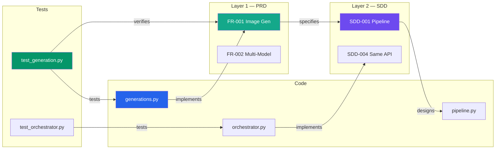

# RWANG / doc-graph — Document Graph, DAG & Symlinks

Build and maintain a living knowledge graph that connects documentation ↔ requirements ↔ code. Track change propagation with a Directed Acyclic Graph (DAG). Manage doc-code symlinks through structured annotations.

## When This Skill Activates

- User asks to "build doc graph", "update graph", "show doc relationships"
- User asks about "doc-code links", "traceability", "what depends on what"
- User asks to "scan annotations", "check drift", "what's stale"
- User runs `/rwang:doc-graph`
- After `rwang:doc-architect` scaffolds a new project
- After significant code or doc changes

## Core Concepts

### Document Graph

A knowledge graph stored in `docs/.doc-graph.json` with:

**Node types** (schema 2.0.0):
| Type | Example | ID Format |
|------|---------|-----------|
| `document` | PRD-SDD-v2.0.md | `doc:<filename>` |
| `section` | §5.5 AI Agent Capabilities | `sec:<doc>:<section-id>` |
| `requirement` | FR-001 Image Generation | `req:<namespace>:<ID>` (e.g. `req:prd:FR-001`, `req:dom:FR-a01001`) |
| `domain` | DOM-01 Playback | `dom:<DOM-ID>` |
| `feature` | FEAT-a01 Queue Management | `feat:<FEAT-ID>` |
| `diagram` | FEAT-a01 sequence diagram | `diag:<path_to_mmd>` |
| `test_spec` | FEAT-a01.test.md | `testspec:<path_to_test_md>` |
| `code_file` | backend/app/ai/agents/orchestrator.py | `code:<path>` |
| `component` | AgentOrchestrator class | `comp:<module>:<name>` |
| `test` | test_orchestrator.py | `test:<path>` |
| `api_endpoint` | POST /v1/generations | `api:<method>:<path>` |
| `db_table` | generations | `db:<table>` |
| `release` | bikeops 2.3.0 (profile-gated) | `rel:<product>@<semver>` |

**Edge types** (canonical predicates — every edge carries `contract_id`, `contract_version`, `semantic_hash`):
| Edge | From → To | Meaning |
|------|-----------|---------|
| `contains` | domain → feature / requirement | Domain owns this feature/requirement |
| `defines` | document / section → requirement / feature | Where the entity's text is defined |
| `specifies` | requirement → feature | Requirement is refined by this feature spec (the ONLY meaning of `specifies`) |
| `visualized_by` | feature → diagram | Feature has this sequence/state model |
| `verified_by` | feature / requirement → test_spec | Pre-code test spec covers this |
| `implements` | code_file → requirement / feature | Code implements this — **code_file sources only**; documents and generated artifacts are never `implements` sources |
| `designs` | section → component | Section designs this component |
| `tests` | test → code_file | Test covers this code |
| `verifies` | test → requirement | Executable test evidence |
| `guides` | test_spec → code_file | Test-spec guidance (profile-gated) |
| `refines` | requirement → requirement | Cross-namespace refinement (e.g. PRD FR-001 → atomic FR-b01001) |
| `supersedes` | document (newer) → document (older) | Version succession; "superseded_by" and "derived/delivered from" are inverse/forward readings of this SAME edge |
| `applies_to` | document / feature / requirement → release | Release binding (profile-gated) |
| `depends_on` | component → component | Runtime dependency |
| `references` | document → document | Cross-document reference |
| `exposes` | code_file → api_endpoint | Code defines this endpoint |
| `persists_to` | component → db_table | Component writes to this table |
| `contradicts` | node → node | Diagnostic edge: conflicting information (requires `reason` + provenance; no semantic contract) |

**`stale` is NOT an edge type** (removed in 2.0.0): staleness is `status: "stale"` + `reason` on the underlying semantic edge. Inverse navigation is a query over the same directed edge — never a second reverse edge (no `visualizes`, no `implemented_by`).

### Contract-Bound Model & Closed-World Registry (schema 2.0.0)

Normative source: [CR-2026-08-20-01 (A2)](../../docs/cr/CR-2026-08-20-01-diagram-test-and-5driven-traceability.md). Summary of the rules this skill enforces:

- **Registry is the identity source of truth** (`docs/registry/`): entity types in `entity-types.yaml`, instances under `entities/`, versioned contracts under `edge-contracts/` (the ONLY place contract definitions live). The graph is a projection — never a second source of truth.
- **Every edge** references a central contract (`contract_id` + `contract_version`) and carries `semantic_hash` = sha256 of the normalized contract it was validated against.
- **Single assertion source:** each edge is asserted once, from the from-side (annotation, frontmatter, or node `manifest.yaml`). No upstream/downstream file pairs.
- **Closed world:** unregistered entities, unknown predicates, invalid endpoints, and uncontracted edges fail with `RWG-*` codes (see CR §2.9) — never silently accepted. Agents may not invent entity types, IDs, predicates, or fields during a scan; agent-actor registry mutations require an `approval_ref` (else `RWG-107`).
- **Validate against schemas** in `references/`: `doc-graph-schema.json`, `entity-registry-schema.json`, `edge-contract-schema.json`, `profile-schema.json`, `node-manifest-schema.json`.

### Change DAG

A Directed Acyclic Graph overlaid on the document graph that tracks change propagation:

```
When a node changes → all downstream edges are marked "potentially stale"
```

**Propagation rules**:
```
requirement changes → flag: sections that specify it
                    → flag: code that implements it
                    → flag: tests that verify it

code changes        → flag: docs that describe it
                    → flag: tests that cover it

section changes     → flag: requirements it specifies (for contradiction check)
                    → flag: components it designs (for drift check)
```

**Depth limit**: Propagation stops after 3 hops to avoid flag storms.

### Doc-Code Symlinks

Structured annotations in code that create bidirectional links:

**Annotation format** (in comments):
```python
# @req FR-001, FR-002 — implements image generation pipeline
# @spec SDD-004 — agents use same pipeline API as UI
# @designs §5.5 — AI Agent Capabilities section
# @tested test_generation.py::test_basic_generation
```

```typescript
// @req FR-001, FR-002 — implements image generation pipeline
// @spec SDD-004 — agents use same pipeline API as UI
// @designs §5.5 — AI Agent Capabilities section
// @tested __tests__/generation.test.ts
```

**Annotation types**:
| Annotation | Meaning | Links To |
|------------|---------|----------|
| `@req <ID>` | This code implements requirement <ID> | requirement node |
| `@spec <ID>` | This code follows design decision <ID> | requirement/section node |
| `@designs <section>` | This code is designed in <section> | section node |
| `@tested <file>` | This code is tested by <file> | test node |

## Process

### Step 0: Load Registry & Profile

Before scanning, load `docs/registry/` (entity types, entity entries, edge contracts) and the active profile. If no registry exists, offer `--bootstrap-registry` (produces a **reviewable proposal** — never silently approves inferred entities) or run in explicit `legacy` mode. Strict mode without a registry fails `RWG-101` for every governed entity.

### Step 1: Scan Documents

Read all files in `docs/` (including `docs/domains/**`) and extract:

1. **Document metadata**: title, `doc_version`, `doc_status`, last-updated, path
2. **Sections**: heading hierarchy with IDs
3. **Requirement IDs**: all FR-xxx, NFR-xxx, SDD-xxx, etc.
4. **Cross-references**: links to other docs, sections, requirements
5. **Diagrams**: standalone `.mmd` files (with `%% @req` / `%% @spec` / `%% @diagram_type` annotations) and embedded Mermaid content
6. **Test specs**: `.test.md` files with `req:` / `spec:` / `test_type:` frontmatter
7. **Node manifests**: `manifest.yaml` files declaring outgoing edge assertions
8. **API endpoints**: mentioned in API docs
9. **DB tables**: mentioned in schema docs

Filename/glob patterns are **discovery hints only** — set membership is decided by the Registry and exact-set reconciliation, never by glob results or hard-coded counts.

### Step 2: Scan Code

Scan source files for:

1. **Structured annotations**: @req, @spec, @designs, @tested
2. **Unstructured references**: plain comments like `# FR-013`, `// implements SDD-004`
3. **Class/function definitions**: to build component nodes
4. **Route definitions**: to build api_endpoint nodes
5. **Model definitions**: to build db_table nodes
6. **Import graph**: to build depends_on edges
7. **Test files**: to build test nodes and verifies edges

**Scan commands**:
```bash
# Structured annotations
grep -rn "@req\|@spec\|@designs\|@tested" \
  --include="*.ts" --include="*.tsx" --include="*.py" \
  --include="*.go" --include="*.java" --include="*.rs" \
  src/ app/ backend/ frontend/

# Unstructured requirement references
grep -rn "FR-[0-9]\|NFR-[0-9]\|SDD-[0-9]\|SEC-[0-9]\|AI-AGT-[0-9]\|AI-ETH-[0-9]" \
  --include="*.ts" --include="*.tsx" --include="*.py" \
  src/ app/ backend/ frontend/

# Route definitions (Python/FastAPI)
grep -rn "@router\.\(get\|post\|put\|delete\|patch\)" \
  --include="*.py" backend/

# Route definitions (Next.js)
find frontend/src/app -name "route.ts" -o -name "route.js"

# Model definitions (SQLAlchemy)
grep -rn "class.*Base)" --include="*.py" backend/app/models/

# Test files
find . -name "test_*.py" -o -name "*.test.ts" -o -name "*.spec.ts"
```

### Step 3: Build Graph (validate-then-project)

Adapters/scanners never write the graph directly. Discovered claims flow through the **Hybrid IR**: entity claims + edge claims + provenance → validated against Registry and Contracts → projected into the graph.

1. Create nodes for all discovered **registered** entities (unregistered → `RWG-101`)
2. Create edges based on:
   - Annotation links (@req → requirement)
   - Manifest assertions (`manifest.yaml` outgoing edges)
   - Test-spec frontmatter and `.mmd` annotations
   - Code references (comment mentions → requirement)
   - Import graph (file A imports from file B → depends_on)
   - Test coverage (test file imports module → tests)
   - API docs ↔ route definitions
   - DB schema docs ↔ model definitions
3. Validate every edge against its contract: endpoint types, predicate, payload, `contract_version`, single from-side assertion (`RWG-201..204`, `RWG-206..209` on failure). `implements` sources must be `code_file` nodes; generated artifacts (traceability matrices, `.upstream.gen.*`) are never evidence sources.
4. Compute content hashes for change detection; stamp each edge's `semantic_hash` from its validated contract

### Step 4: Detect Drift

Compare current graph against the previous version (if exists):

```
For each node:
  current_hash = hash(current file content)
  stored_hash  = node.hash from .doc-graph.json

  if current_hash != stored_hash:
    mark node as CHANGED
    propagate staleness to downstream nodes (up to 3 hops)
```

### Step 5: Reconcile Sets (gate before publication)

Let **R** = active registry IDs, **F** = filesystem-discovered IDs, **M** = manifest/annotation assertions, **G** = graph node IDs, **T** = traceability IDs — per entity type, per profile-required view. Publication requires **R = F = G = T** with M consistent. On any mismatch, report the applicable `RWG-*` code (CR §2.9) with per-ID detail and remediation — never publish a projection that fails reconciliation. Compare by **stable ID sets**, never by counts.

Key codes: `RWG-101` unregistered entity, `RWG-102` orphaned registry entry, `RWG-103` stale graph (regenerate from the merged checkout), `RWG-104` graph node without registry backing, `RWG-105` traceability mismatch, `RWG-106` duplicate entity ID (report both provenances), `RWG-108` governed doc changed without `doc_version` bump.

In workspaces without git, `source_ref` uses a content-digest of the discovery set; semantics are unchanged.

Runnable implementation: `scripts/validate-graph.ps1 -Root <project>` executes contract validation + exact-set reconciliation and emits `RWG-*` findings as JSON (`-Mode hash` prints normalized contract hashes for stamping/re-approval). Acceptance fixtures live in `tests/fixtures/mini-5driven/` with the mutation suite `tests/validate-graph.tests.ps1`.

### Step 6: Generate Outputs

#### 6a. Updated `docs/.doc-graph.json`

```json
{
  "version": "2.0.0",
  "generated_by": "rwang:doc-graph",
  "generated_at": "2026-08-20T12:00:00Z",
  "source_ref": "9f31c2ab",
  "profile_id": "5-driven-domain",
  "provenance": {
    "actor_type": "agent",
    "actor_id": "claude-fable-5",
    "session_id": "<opaque>",
    "tool": "rwang:doc-graph",
    "tool_version": "1.1.0",
    "timestamp": "2026-08-20T12:00:00Z",
    "source_ref": "9f31c2ab",
    "approval_ref": "CR-2026-08-20-01#A2"
  },
  "stats": {
    "total_nodes": 142,
    "total_edges": 387,
    "stale_edges": 5,
    "contradiction_edges": 0,
    "coverage": {
      "requirements_with_code": { "covered": 114, "total": 120 },
      "requirements_with_tests": { "covered": 94, "total": 120 },
      "code_with_docs": { "covered": 43, "total": 69 }
    }
  },
  "nodes": [
    {
      "id": "dom:DOM-01",
      "type": "domain",
      "label": "Playback",
      "path": "docs/domains/DOM-01--playback",
      "status": "current"
    },
    {
      "id": "req:prd:FR-001",
      "type": "requirement",
      "label": "Image Generation",
      "defined_in": "docs/PRD-SDD-v2.0.md",
      "section": "§5.1",
      "hash": "a1b2c3d4",
      "status": "current",
      "last_verified": "2026-08-20T12:00:00Z"
    },
    {
      "id": "code:backend/app/api/generations.py",
      "type": "code_file",
      "label": "generations.py",
      "hash": "e5f6g7h8",
      "status": "changed",
      "last_verified": "2026-08-01T00:00:00Z",
      "annotations": {
        "@req": ["FR-001", "FR-002"],
        "@spec": ["SDD-001"]
      }
    }
  ],
  "edges": [
    {
      "from": "code:backend/app/api/generations.py",
      "to": "req:prd:FR-001",
      "type": "implements",
      "contract_id": "edge:code_file_implements_requirement",
      "contract_version": "1.0.0",
      "semantic_hash": "sha256:...",
      "status": "current",
      "source": "annotation"
    },
    {
      "from": "code:backend/app/api/generations.py",
      "to": "req:prd:FR-002",
      "type": "implements",
      "contract_id": "edge:code_file_implements_requirement",
      "contract_version": "1.0.0",
      "semantic_hash": "sha256:...",
      "status": "stale",
      "reason": "code changed 2026-08-05, requirement doc last updated 2026-07-20",
      "source": "annotation"
    }
  ]
}
```

Note in the second edge: staleness is `status: "stale"` on the semantic `implements` edge — there is no `stale` edge type.

#### 6b. Traceability Matrix (auto-generated)

Generate `docs/appendices/D-traceability.md`. The matrix is a generated projection: it is **never** an evidence source (a row here proves nothing by itself), and its ID set must reconcile with the graph (`RWG-105`). "Implemented By" lists `code_file` nodes only — never documents and never this file itself:

```markdown
# Appendix D — Traceability Matrix

*Auto-generated by RWANG doc-graph on 2026-08-20 (source_ref: 9f31c2ab)*

| Req ID | Title | Defined In | Illustrated By (Diagram) | Implemented By (Code) | Verified By (Test Spec / Test) | Status |
|--------|-------|------------|--------------------------|------------------------|-------------------------------|--------|
| FR-001 | Image Generation | §5.1 | FEAT-a01_sequence.mmd | generations.py, pipeline.py | FEAT-a01.test.md / test_generation.py | ✅ Current |
| FR-002 | Multi-Model Support | §5.1 | — | model_selector.py | test_model_selector.py | ✅ Current |
| FR-003 | Prompt Control | §5.1 | — | — | — | 🔴 Not Implemented |
| AI-AGT-001 | Prompt Enhancer | §19 | — | prompt_enhancer.py | test_prompt_enhancer.py | 🟠 Stale |
```

#### 6c. Visual Graph (Mermaid)

Generate a Mermaid diagram showing the graph structure:



#### 6d. Coverage Report

```markdown
## Doc-Code Coverage

| Metric | Value | Target |
|--------|-------|--------|
| Requirements with code refs | 95% (114/120) | 100% |
| Requirements with test refs | 78% (94/120) | 90% |
| Code files with doc refs | 62% (43/69) | 80% |
| Structured annotations (@req) | 0% (0/69) | 50%+ |
| Unstructured refs (# FR-xxx) | 89% (62/69) | — |

### Gaps

**Requirements not yet implemented** (6):
- FR-003, FR-017, FR-022, NFR-008, NFR-012, BR-005

**Code files with no doc references** (26):
- frontend/src/components/ui/button.tsx
- frontend/src/components/ui/input.tsx
- ... (list all)
```

## Annotation Migration Guide

If the project has unstructured references (comments like `# FR-013`) but no structured annotations, offer to help migrate:

```markdown
## Migration Opportunity

Found 293 unstructured requirement references across 69 files.
Found 0 structured annotations (@req, @spec, @designs, @tested).

### Example migration:

**Before** (unstructured):
```python
# FR-001: Image generation endpoint
@router.post("/v1/generations")
async def create_generation(...):
```

**After** (structured):
```python
# @req FR-001 — Image generation endpoint
# @spec SDD-001 — Uses pipeline node registry
# @designs §5.1
# @tested test_generation.py::test_create_generation
@router.post("/v1/generations")
async def create_generation(...):
```

Want me to generate a migration script?
```

## Git Hook Integration

This skill generates drift detection data that the RWANG git hook can use. After updating the graph, check if `hooks/hooks.json` is installed and remind the user if not:

```markdown
💡 **Tip**: Install the RWANG git hook to auto-detect drift on every commit:
The hook compares changed files against the doc graph and warns if
documentation may need updating.
```

## Important Rules

- **Always update the hash** — every node gets a fresh content hash on each scan
- **Manual edges must validate** — an edge with `source: "manual"` is preserved *only if* it passes full contract validation like any other edge; `manual` marks provenance, not a bypass (CR A2 §4.5)
- **Incremental only when reconciled** — incremental update is allowed only when exact-set reconciliation passes; any `RWG-103..106` finding forces full regeneration from the current (merged) checkout (CR A2 §4.5)
- **Single writer** — only this skill writes `.doc-graph.json`; every projection carries `source_ref` + provenance
- **Generated artifacts are never evidence** — traceability matrices and `.upstream.gen.*` files never source an edge
- **Inverse is a query** — never materialize a reverse edge; upstream views come from the retrieval layer
- **No counts, no glob-truth** — validate by stable-ID sets against the Registry; glob patterns are discovery hints
- **3-hop propagation limit** — DAG staleness propagation stops after 3 edges to avoid noise
- **Don't auto-fix** — report drift and staleness, let the user decide what to update; scaffolding requires explicit user authorization
- **Respect .gitignore** — don't scan node_modules, __pycache__, .venv, etc.
- **Generate the traceability matrix** — always produce/update appendix D after a full scan
- **Bilingual** — respond in user's language; keep node IDs and technical terms in English
