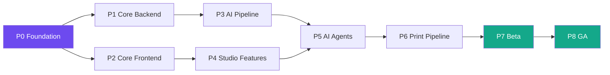

# RWANG / implementation-plan — Phase-by-Phase Implementation Roadmap

Generate a comprehensive implementation plan from verified project documentation. This skill reads the PRD, SDD, design system, and doc graph to produce an actionable roadmap.

## When This Skill Activates

- User asks to "create implementation plan", "make a roadmap", "plan the sprints"
- User asks "how should we build this?", "what's the development timeline?"
- User runs `/rwang:implementation-plan`
- After `rwang:doc-preflight` passes with no critical findings

## Prerequisites

Before generating a plan, verify:

```
1. ✅ Main PRD/SDD document exists and has requirements with IDs
2. ✅ doc-preflight has been run (check docs/.preflight-report.json)
3. ✅ No CRITICAL findings in preflight (warn if there are)
4. ✅ doc-graph.json exists (for dependency data)
```

If prerequisites aren't met, suggest running the required skills first.

## Process

### Phase 1: Extract Implementation Scope

Read all documentation and extract:

1. **Functional Requirements** (FR-xxx) → list with complexity estimate
2. **Non-Functional Requirements** (NFR-xxx) → list with infrastructure needs
3. **Components** from SDD → list with dependencies
4. **API Endpoints** → list with complexity
5. **Database Models** → list with relationships
6. **AI/ML Components** (if any) → list with training/infra needs
7. **Third-party Integrations** → list with vendor dependencies
8. **Infrastructure** → list of services to deploy

### Phase 2: Estimate Complexity

For each requirement/component, estimate:

| Factor | Scale | Points |
|--------|-------|--------|
| **Scope** | Small / Medium / Large / XL | 1 / 2 / 5 / 8 |
| **Technical Risk** | Low / Medium / High | 0 / 2 / 5 |
| **Dependencies** | None / Internal / External | 0 / 1 / 3 |
| **AI/ML Factor** | None / Fine-tune / Train / Research | 0 / 2 / 5 / 8 |

**Total points** = Scope + Risk + Dependencies + AI/ML

### Phase 3: Dependency Analysis

Using the doc graph, build a dependency tree:

```
1. Extract all depends_on edges from doc-graph.json
2. Build a topological sort of components
3. Identify the critical path (longest dependency chain)
4. Identify parallelizable work (independent subtrees)
5. Flag circular dependencies (error)
```

### Phase 4: Team & Sprint Planning

#### Team Sizing Formula

```
Base team size = ceil(total_points / (points_per_sprint * target_sprints))

Where:
  points_per_sprint = 20 (for a 2-week sprint with 1 dev)
  target_sprints = user-specified or auto-calculated

Add specialists:
  + 1 DevOps if infra complexity > 5
  + 1 AI/ML engineer if AI components exist
  + 1 Designer if frontend design system exists
  + 0.5 QA per 3 developers
  + 1 Tech Lead if team > 5
```

#### Sprint Allocation

Map requirements to sprints using:

1. **Dependency order** — don't schedule B before A if B depends on A
2. **Risk front-loading** — high-risk items in early sprints
3. **Vertical slices** — each sprint delivers a testable increment
4. **Capacity constraints** — don't exceed sprint velocity

### Phase 5: Risk Assessment

For each risk, score:

```
Risk Score = Probability (1-5) × Impact (1-5)

Categories:
  1-6:   Low (accept)
  7-14:  Medium (mitigate)
  15-25: High (avoid/transfer)
```

**Standard risks to always evaluate**:
1. GPU availability and cost
2. AI model quality / accuracy
3. Third-party API changes
4. Performance at scale
5. Data migration complexity
6. Team skill gaps
7. Scope creep
8. Integration complexity
9. Security vulnerabilities
10. Regulatory compliance

### Phase 6: Generate the Plan

#### Output Structure

```markdown
# Implementation Plan — [Project Name]

| Field | Value |
|-------|-------|
| **Version** | 1.0.0 |
| **Generated** | [date] |
| **Generated By** | RWANG implementation-plan |
| **Source Docs** | [list of docs used] |
| **Preflight Status** | [PASS/WARN — link to report] |

## 1. Scope Summary

### 1.1 By the Numbers
| Metric | Count |
|--------|-------|
| Functional Requirements | [n] |
| Non-Functional Requirements | [n] |
| API Endpoints | [n] |
| Database Tables | [n] |
| AI/ML Components | [n] |
| Total Complexity Points | [n] |

### 1.2 Out of Scope
[Explicitly list what is NOT included]

## 2. Phasing Strategy

### Phase Overview

| Phase | Name | Sprints | Focus | Key Deliverable |
|-------|------|---------|-------|-----------------|
| P0 | Foundation | S1-S2 | Infra, auth, CI/CD | Dev environment running |
| P1 | Core Backend | S3-S5 | API, DB, pipeline | First API endpoint live |
| P2 | Core Frontend | S4-S6 | UI kit, canvas, layout | Interactive canvas |
| ... | ... | ... | ... | ... |

### Critical Path



## 3. Sprint Detail

### Sprint 1 — [Name] (Week 1-2)

**Goal**: [One sentence]

**Capacity**: [n] developers × 2 weeks = [n] person-days

| Task | Req IDs | Assigned To | Points | Dependencies |
|------|---------|-------------|--------|--------------|
| Set up monorepo | IR-001 | DevOps | 3 | None |
| PostgreSQL schema v1 | DR-001 | Backend | 5 | None |
| Auth module (JWT) | SEC-001 | Backend | 5 | DR-001 |
| CI pipeline | IR-002 | DevOps | 3 | IR-001 |
| Design token setup | — | Frontend | 2 | None |

**Sprint total**: 18 points
**Risk**: Low — all standard infrastructure work
**Definition of done**: Dev can `docker compose up` and hit /health

### Sprint 2 — ...

[Continue for each sprint]

## 4. Team Structure

| Role | Count | Responsibility |
|------|-------|----------------|
| Tech Lead | 1 | Architecture decisions, code review |
| Backend Developer | [n] | API, DB, pipeline |
| Frontend Developer | [n] | UI, canvas, design system |
| AI/ML Engineer | [n] | Model integration, agents |
| DevOps | [n] | Infra, CI/CD, monitoring |
| QA | [n] | Testing, quality |
| Designer | [n] | UI/UX, design system |

**Total**: [n] FTE

## 5. Milestones

| ID | Milestone | Sprint | Date (est.) | Gate Criteria |
|----|-----------|--------|-------------|---------------|
| M1 | First Generation | S4 | [date] | User can generate 1 image via UI |
| M2 | Private Beta | S7 | [date] | 10 users, core features complete |
| M3 | AI Agents Live | S10 | [date] | All 4 agents operational |
| M4 | Public Beta | S12 | [date] | Print pipeline, CMYK, export |
| M5 | GA | S20 | [date] | All requirements met, SLA defined |

## 6. Risk Register

| ID | Risk | Prob | Impact | Score | Mitigation | Owner |
|----|------|------|--------|-------|------------|-------|
| R1 | GPU costs exceed budget | 3 | 4 | 12 | Spot instances, model optimization | DevOps |
| R2 | AI model quality insufficient | 3 | 5 | 15 | Multiple model fallback, quality gates | AI Lead |
| ... | ... | ... | ... | ... | ... | ... |

**Risk budget**: Add 25% buffer to all estimates for risk.

## 7. Deployment Strategy

### Environments
| Env | Purpose | Deploy Trigger |
|-----|---------|----------------|
| Local | Development | `docker compose up` |
| Staging | Integration testing | Push to `develop` |
| Production | Live users | Manual gate from staging |

### Feature Flags
| Flag | Feature | Default | Remove After |
|------|---------|---------|--------------|
| `FF_AI_AGENTS` | AI agent system | OFF | M3 verified |
| `FF_CMYK_EXPORT` | CMYK color conversion | OFF | M4 verified |
| ... | ... | ... | ... |

## 8. Requirement-to-Sprint Mapping

[Full matrix mapping every FR/NFR/SDD to its target sprint]

| Req ID | Title | Sprint | Status |
|--------|-------|--------|--------|
| FR-001 | Image Generation | S3 | Planned |
| FR-002 | Multi-Model Support | S4 | Planned |
| ... | ... | ... | ... |
```

## Customization Options

When generating the plan, ask the user for (or detect from context):

| Parameter | Default | User Can Override |
|-----------|---------|-------------------|
| Sprint length | 2 weeks | 1-4 weeks |
| Team size | Auto-calculated | Fixed number |
| Target timeline | Auto-calculated | "Must ship by Q2 2027" |
| Risk buffer | 25% | 0-50% |
| Phase granularity | Medium (5-8 phases) | Coarse (3-4) or Fine (10+) |
| Start date | Today | Specific date |

## Validation

After generating the plan, self-check:

```
✅ Every FR/NFR has a sprint assignment
✅ No sprint exceeds capacity (points_per_dev × num_devs)
✅ Dependencies are respected (B not before A if B depends on A)
✅ Critical path is highlighted
✅ Risk register has at least 5 entries
✅ Milestones have gate criteria (not just dates)
✅ Feature flags listed for risky features
✅ Total timeline includes risk buffer
✅ All phases have at least one deliverable
✅ Sprint 1 is achievable by a new team (foundational work)
```

## Output Files

1. **`docs/implementation-plan.md`** — the full plan (human-readable)
2. **Update `docs/.doc-graph.json`** — add plan nodes and edges (plan → requirements)
3. **Console summary** — high-level timeline and team size

## Important Rules

- **Don't plan without docs** — refuse if no PRD/SDD exists; suggest doc-architect first
- **Warn on preflight failures** — if critical findings exist, warn prominently
- **Vertical slices** — every sprint must produce something testable
- **Front-load risk** — high-risk items early, not late
- **Don't over-plan** — Sprint-level detail for first 30% of timeline, phase-level for the rest
- **Capacity is king** — never schedule more points than the team can handle
- **Include buffer** — 25% minimum risk buffer on all estimates
- **Trace everything** — every task links back to requirement IDs
- **Bilingual** — respond in user's language; keep IDs, dates, and technical terms in English
