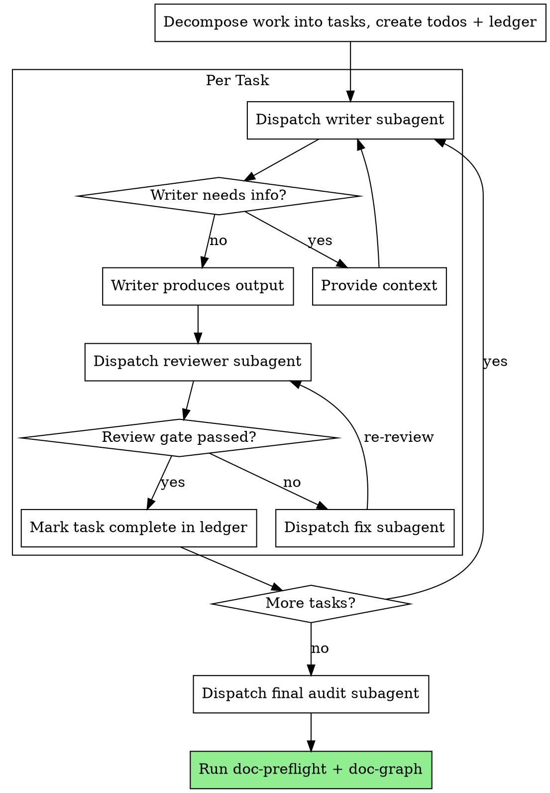

# RWANG / subagent-driven — Dispatch, Review, Iterate

Execute document intelligence work by dispatching a fresh subagent per task, a doc-quality review gate after each, and a final consistency audit across all outputs.

**Why subagents for doc work:** Documentation tasks are deceptively context-heavy. An agent writing §5.5 AI Agent Capabilities shouldn't carry the residue of §3 Stakeholder Analysis in its context — it leads to bleed, contradictions, and copy-paste artifacts. Fresh context per section = cleaner output. The controller (you) holds the cross-section picture; the workers hold their section.

**Core principle:** Fresh subagent per task + review gate (completeness + consistency + traceability) + final audit = high quality, fast iteration

**Narration:** Between tool calls, narrate at most one short line. The ledger and tool results carry the record.

**Continuous execution:** Do not pause to check in with the user between tasks. Execute all tasks without stopping. The only reasons to stop are: BLOCKED status you cannot resolve, ambiguity that genuinely prevents progress, or all tasks complete.

## When to Use

| Scenario | Use This Skill |
|----------|----------------|
| Writing 3+ doc sections from scratch | ✅ Yes |
| Full RWANG pipeline (architect → preflight → graph → plan) | ✅ Yes |
| Rewriting/refactoring existing docs across sections | ✅ Yes |
| Migrating plain comments to @req annotations project-wide | ✅ Yes |
| Creating a single document section | ❌ No — do it directly |
| Running one preflight check | ❌ No — use `/rwang:doc-preflight` |
| Quick graph update | ❌ No — use `/rwang:doc-graph` |

## Process

```
PLAN → [DISPATCH → REVIEW → FIX]* → FINAL AUDIT → DONE
```



## Phase 0: Decompose Work

Before dispatching Task 1, decompose the full scope into discrete tasks.

**Task granularity rules:**
- One task = one document section, one appendix, one code-annotation batch, or one skill output
- Never combine "write §5.1 + §5.2 + §5.3" into one task — each section is a task
- Preflight/graph/plan generation are their own tasks at the end
- Group annotation migration by directory (e.g. "annotate backend/app/api/*.py")

**Task ordering rules:**
- Foundation first: Executive Summary → Scope → Stakeholders → Use Cases
- Requirements before design: FRs/NFRs → Architecture → Component Design
- Design before AI: SDD sections → Agent Architecture → Model Cards
- Appendices last (they reference main doc)
- Preflight runs after all writing tasks
- Doc-graph runs after preflight
- Implementation-plan runs last

**Create the ledger** at `docs/.rwang-progress.md`:

```markdown
# RWANG Subagent Progress Ledger

| Task | Status | Subagent | Review | Notes |
|------|--------|----------|--------|-------|
| T1: Executive Summary | ⏳ pending | — | — | |
| T2: Scope & Boundaries | ⏳ pending | — | — | |
| ... | ... | ... | ... | |
```

**Pre-flight plan review:** Scan all tasks for contradictions before starting:
- Tasks that reference conflicting technologies
- Tasks that define the same requirement ID
- Tasks that assume different architectural decisions
- Present all conflicts as one batch question to the user

## Phase 1: Per-Task Cycle

### 1a. Dispatch Writer Subagent

Construct the writer prompt with exactly:

1. **Role**: "You are a technical documentation writer for [project name]."
2. **Task**: The specific section to write, with its scope boundaries
3. **Input context** (as file paths, not pasted content):
   - The template structure from `rwang-plugin/references/templates.json`
   - The existing document (if updating/extending)
   - Relevant source code files (if the section describes code)
   - Prior completed sections that this section references
4. **Constraints**:
   - Requirement ID scheme and next available IDs
   - IEEE/ISO standards to follow
   - Design token values (if frontend-related)
   - Trust hierarchy: Code > SDD > PRD
   - Bilingual convention (technical English, descriptive Thai OK)
5. **Output contract**: What the subagent must produce and where to write it
6. **Report file path**: Where to write the structured report

**Writer report contract:**

```markdown
## Writer Report — Task [N]: [Title]

**Status**: DONE | DONE_WITH_CONCERNS | NEEDS_CONTEXT | BLOCKED

**Output file(s)**:
- [path] — [what was written]

**Requirement IDs created**: [list new IDs, e.g. FR-014 through FR-018]

**Cross-references added**: [list references to other sections]

**Concerns** (if DONE_WITH_CONCERNS):
- [specific concern]

**Missing context** (if NEEDS_CONTEXT):
- [what is needed and why]
```

### 1b. Handle Writer Status

| Status | Action |
|--------|--------|
| **DONE** | Proceed to review |
| **DONE_WITH_CONCERNS** | Read concerns. If correctness/scope → address before review. If observations → note in ledger, proceed to review. |
| **NEEDS_CONTEXT** | Provide missing context (read the files, answer the question), re-dispatch |
| **BLOCKED** | Assess: context problem → provide and retry. Task too large → split. Plan wrong → ask user. |

### 1c. Dispatch Reviewer Subagent

The reviewer gets a **different subagent** (never the writer reviewing itself). Construct the review prompt with:

1. **Role**: "You are a document quality reviewer for [project name]."
2. **Inputs** (as file paths):
   - The output file(s) from the writer
   - The task brief (what was requested)
   - The existing doc graph (if available)
   - The project's requirement ID registry
3. **Review rubric** (see below)
4. **Report file path**: Same report file, appended

**Review Rubric — 6-Point Gate:**

```markdown
## Review Gate Rubric

### 1. Completeness (PASS/FAIL)
- All sections specified in the task brief are present
- No TODO/TBD/placeholder text
- Required diagrams (if any) are present and valid Mermaid

### 2. Requirement Traceability (PASS/FAIL)
- Every FR/NFR/SDD/etc. has a unique ID
- No duplicate IDs across the project
- No gaps in ID sequences
- IDs follow the project's scheme (FR-xxx, not FR-x or REQ-xxx)

### 3. Internal Consistency (PASS/FAIL)
- No contradictions within this section
- No contradictions with sections completed in prior tasks
- Technology names match (e.g., "PostgreSQL" not sometimes "Postgres" sometimes "PG")
- Numbers agree (if §5 says "300 DPI" then §9 doesn't say "150 DPI")

### 4. Standards Compliance (PASS/WARN)
- Document Control block present (version, date, author, status)
- IEEE 29148 structure followed (if SRS/requirements section)
- IEEE 1016 structure followed (if SDD/design section)
- ISO/IEC 42001 addressed (if AI/ML section)

### 5. Code Alignment (PASS/WARN)
- If this section describes existing code, the description matches the actual code
- API endpoints in docs match route definitions in code
- Data models in docs match actual model files
- Trust hierarchy applied: if code disagrees with doc draft, flag it

### 6. Writing Quality (PASS/WARN)
- Technical terms in English
- Bilingual convention maintained (if applicable)
- No copy-paste artifacts from other sections
- Appropriate detail level (not too sparse, not over-verbose)
- Diagrams have titles and are referenced in text
```

**Review verdicts:**

| Verdict | Meaning | Action |
|---------|---------|--------|
| ✅ **ALL PASS** | All 6 checks passed | Mark complete, next task |
| ⚠️ **WARN** | Checks 4-6 have warnings | Note in ledger, proceed (fix in final audit) |
| ❌ **FAIL** | Any of checks 1-3 failed | Dispatch fix subagent, re-review |

**Critical rule:** Checks 1-3 (Completeness, Traceability, Consistency) are hard gates. A FAIL on any of these blocks progression. Checks 4-6 are soft gates — warnings are noted and can be batch-fixed in the final audit.

### 1d. Fix Cycle

When the review gate fails:

1. Dispatch a **fix subagent** (fresh context) with:
   - The reviewer's specific findings
   - The output file to fix
   - The original task brief
   - Instruction: "Fix only the listed findings. Do not rewrite other sections."
2. Re-dispatch the **reviewer** (fresh context) to re-review
3. Repeat until gate passes
4. Maximum 3 fix cycles per task — if still failing, escalate to user

### 1e. Update Ledger

After review passes:

```markdown
| T3: Functional Requirements | ✅ done | writer-03 | clean | FR-001 through FR-022 created |
```

## Phase 2: Final Audit

After all writing tasks complete, run three audit steps:

### 2a. Cross-Section Consistency Audit

Dispatch an audit subagent that reads ALL completed sections and checks:

```markdown
## Cross-Section Audit Checklist

1. **Terminology consistency**: Same term used the same way everywhere
2. **Requirement coverage**: Every FR in §5 appears in architecture §9
3. **Data flow consistency**: Inputs/outputs match across components
4. **Diagram consistency**: All components in arch diagram appear in component design
5. **Version/date alignment**: All sections show same version and date
6. **Glossary completeness**: All technical terms defined
7. **Cross-reference validity**: All §X.Y references resolve
8. **ID uniqueness**: No duplicate requirement IDs across all sections
```

### 2b. Run doc-preflight

Invoke `rwang:doc-preflight` to run the full 10-point automated health check. Fix any CRITICAL findings with a fix subagent.

### 2c. Run doc-graph

Invoke `rwang:doc-graph` to build/update the document graph and traceability matrix. This validates all doc-code links and produces the final coverage report.

## Model Selection

Match model capability to task complexity — don't burn expensive models on mechanical work.

| Task Type | Model Tier | Rationale |
|-----------|------------|-----------|
| Boilerplate sections (glossary, doc control) | **Cheap** (haiku) | Mechanical, template-fill |
| Standard doc sections (use cases, NFRs) | **Mid** (sonnet) | Needs domain understanding |
| Architecture, AI system design | **Capable** (opus) | Requires judgment and synthesis |
| Annotation migration (batch @req insertion) | **Cheap** (haiku) | Pattern matching, no judgment |
| Section review (per-task gate) | **Mid** (sonnet) | Needs consistency checking |
| Cross-section audit (final) | **Capable** (opus) | Needs broad reasoning |
| Fix subagent | **Same as writer** | Same complexity as original |

**Always specify the model explicitly.** Omitting it inherits your session model (often the most expensive).

## File Handoffs

Everything the controller pastes into a dispatch prompt stays in context. Use file handoffs:

- **Task brief**: Write the task description to `docs/.rwang-tasks/task-N-brief.md`
- **Writer report**: Writer outputs to `docs/.rwang-tasks/task-N-report.md`
- **Review findings**: Reviewer appends to the same report file
- **Fix instructions**: Fix subagent reads findings from the report file

**Never paste prior-task summaries into later dispatches.** The writer gets its task brief, the relevant existing files, and cross-section interfaces. Nothing else.

## Durable Progress

The ledger at `docs/.rwang-progress.md` survives context compaction.

- **At skill start**: Check for existing ledger. Tasks marked `✅ done` are DONE — do not re-dispatch.
- **After each task**: Update ledger immediately in the same message as other bookkeeping.
- **After compaction**: Trust the ledger over your own recollection. Read it and resume at the first non-complete task.

## Example: Full PRD/SDD Creation (3-Layer + Appendix)

```
Controller: Using RWANG subagent-driven to create full project documentation.

[Read project, run doc-architect scoring → user confirms 3-Layer + Appendix]
[Decompose into 18 tasks, create ledger]

Task 1: Document Control & Version History
  [Dispatch haiku writer → boilerplate task]
  [Review gate: ✅ PASS — template filled correctly]
  Ledger: T1 ✅ done

Task 2: Executive Summary
  [Dispatch sonnet writer with project README + existing PRD]
  [Review gate: ⚠️ WARN — missing Thai bilingual, otherwise clean]
  Ledger: T2 ✅ done (warn: bilingual)

Task 3: Scope & Boundaries
  [Dispatch sonnet writer]
  [Review gate: ✅ PASS]
  Ledger: T3 ✅ done

Task 4: Stakeholders & Personas
  Writer: "NEEDS_CONTEXT — how many personas? What are the user types?"
  Controller: [Reads existing PRD, provides 5 personas from original doc]
  [Re-dispatch writer with context]
  [Review gate: ✅ PASS]
  Ledger: T4 ✅ done

...

Task 10: AI Agent Architecture (Layer 3)
  [Dispatch opus writer — needs design judgment]
  [Review gate: ❌ FAIL — Consistency: agent state machine references
   "SELECTING" state but §5.5 never defines model selection as a step]
  [Dispatch fix subagent → adds SELECTING to §5.5 flow]
  [Re-review: ✅ PASS]
  Ledger: T10 ✅ done

...

Task 16: Appendix D — Traceability Matrix
  [Dispatch haiku writer — mechanical cross-reference table]
  [Review gate: ❌ FAIL — Traceability: FR-003 missing from matrix]
  [Dispatch fix subagent → adds FR-003 row]
  [Re-review: ✅ PASS]
  Ledger: T16 ✅ done

Task 17: Cross-Section Audit
  [Dispatch opus auditor — reads all 16 completed sections]
  Findings: 2 terminology inconsistencies, 1 missing glossary entry
  [Dispatch fix subagent → batch fix]
  Ledger: T17 ✅ done

Task 18: Automated Checks
  [Run rwang:doc-preflight → 0 CRITICAL, 1 WARN (frontend has 0 annotations)]
  [Run rwang:doc-graph → graph built, 95% req coverage, traceability matrix generated]
  Ledger: T18 ✅ done

Done! 18/18 tasks complete. 2 review-gate failures caught and fixed.
```

## Integration with Other RWANG Skills

| RWANG Skill | Role in Subagent-Driven |
|-------------|------------------------|
| `doc-architect` | Run first to determine template → drives task decomposition |
| `doc-preflight` | Final audit step (Task N-1) |
| `doc-graph` | Final audit step (Task N) |
| `implementation-plan` | Optional follow-up after all docs verified |

## Red Flags

**Never:**
- Let a writer review its own output (always a separate reviewer subagent)
- Skip the review gate — even for "simple" sections like glossaries
- Paste all prior sections into a writer's context (use file references)
- Combine multiple sections into one writer dispatch
- Ignore a FAIL on checks 1-3 (hard gates are hard)
- Re-dispatch a task the ledger marks as done
- More than 3 fix cycles on one task without escalating
- Dispatch the final audit before all writing tasks are ledger-complete
- Skip the automated checks (preflight + doc-graph) at the end
- Pre-judge reviewer findings ("don't flag X as an issue")

**If writer asks questions:**
- Answer from existing project files (code, docs, config)
- If the answer isn't in the project, ask the user once, batch all unknowns
- Don't guess — wrong context produces contradictions that the review gate catches late

**If reviewer finds contradictions with prior sections:**
- This is a cross-task consistency issue — the controller resolves it
- Read both sections, determine which is correct (trust hierarchy: Code > SDD > PRD)
- Dispatch fix subagent to the section that's wrong
- Re-review both the fixed section and the section it contradicted
