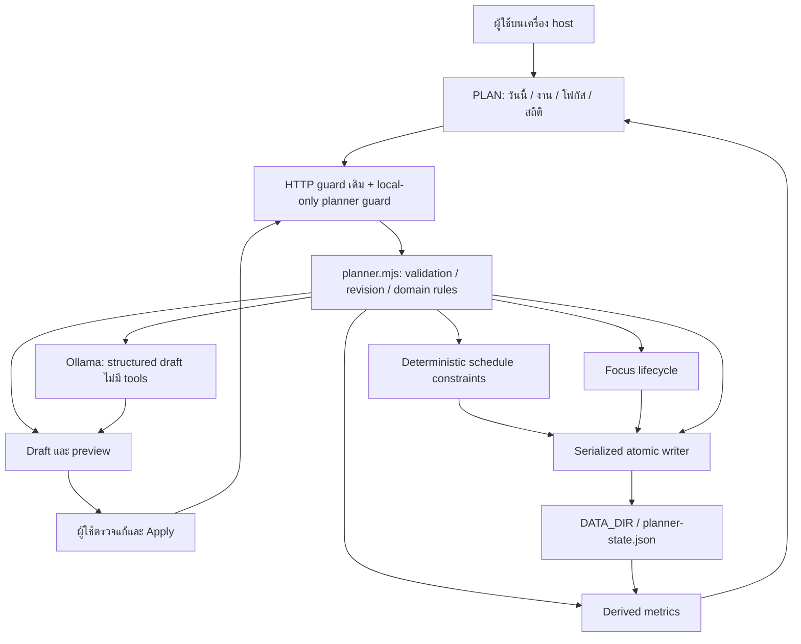

# RWANG Productivity — ข้อเสนอจากภาพอ้างอิง

## 1. สถานะและขอบเขตการอนุมัติ

เอกสารนี้สกัดฟีเจอร์จากภาพ OrbitAI 3 ภาพที่ผู้ใช้ส่งให้ แล้วเสนอวิธีเพิ่มเข้า RWANG
สถานะ **APPROVED P1–P3 / IMPLEMENTED LOCALLY / UAT INCOMPLETE**
ผลทดสอบจริงและข้อจำกัดอยู่ใน [Productivity gate report](PRODUCTIVITY-GATE-REPORT.md)
Full acceptance ยังรอ functional cases ที่ไม่ครบ, packaged desktop/PWA และ accessibility
ตามตาราง UAT coverage audit ในรายงาน; automated tests และ browser flows ที่ผ่านยังไม่ยืนยันทุกจุด
UAT รอบต่อเนื่องยืนยัน What-if, ค้นหา, สองแท็บโฟกัส, positive insights, packaged sidecar
และ preview cancellation แล้ว พร้อมปิด G-18 เรื่องบันทึก timezone และ G-19 เรื่อง review state
ค้างหลังเปลี่ยนวัน; ช่องว่างที่เหลือยังคงเป็น partial UAT ตามรายงาน
ผล local ไม่ใช่ clean-machine หรือ release acceptance และไม่เปลี่ยน PRD Persona ที่อนุมัติไว้

งานเป็น **C-3 — Doc → Diagram → Contract/Test → Code** ความเสี่ยง **HIGH**
เพราะเพิ่มโดเมนข้อมูลถาวรและ API ที่เชื่อม UI, โมเดล และการตรวจสิทธิ์
ผู้ใช้อนุมัติให้ทำ P1–P3 ผ่านคำสั่งสร้าง agent fleet (Luna max) เมื่อ 2026-09-17
หลังได้รับข้อเสนอและคำขออนุมัติสเปกนี้แล้ว จึงเริ่มโค้ดตาม AGENTS.md ข้อ R5 ได้
คำสั่งแก้ปัญหา code/doc ก่อนหน้านี้ไม่ถูกตีความเป็นการอนุมัติฟีเจอร์ชุดนี้

ขอบเขตที่อนุมัติคือ **P1–P3** ในส่วน 10; Calendar Sync เป็น P4 แยกต่างหาก
เลขผลิตภัณฑ์ 0.6.0 เป็นข้อเสนอ ยังไม่แก้ package version หรือประกาศ release

### [ASSUMPTIONS] ของขอบเขตที่อนุมัติ

1. เพิ่มความสามารถให้ผู้ใช้คนเดียวบน RWANG local-first, ภาษาไทยเป็นหลัก
2. ใช้ชื่อ รูปลักษณ์ และโครง UI ของ RWANG; ภาพเป็นตัวอย่างความสามารถ ไม่ใช่คำสั่งให้เปลี่ยนแบรนด์
3. งาน ระดับพลังงาน เวลาว่าง และเป้าหมายโฟกัสมาจากผู้ใช้; ไม่อนุมานความเหนื่อยจากกล้อง เสียง หรือ biometrics
4. AI ช่วยเสนอ ผู้ใช้ตรวจและบันทึกเอง; แบบฟอร์ม งาน และตัวจับเวลาใช้ได้แม้ Ollama ไม่พร้อม
5. รุ่นแรกใช้จากเครื่อง host เท่านั้น; responsive UI ไม่ได้หมายถึงเพิ่มสิทธิ์ให้ paired device

## 2. แหล่งภาพและการตีความ

| แหล่ง | ไฟล์ที่ผู้ใช้ให้ | สิ่งที่เห็น |
|---|---|---|
| IMG-01 | `C:/Users/pc/Downloads/696a328e7536e244040817.jpg` | หน้า Insights, KPI และกราฟรายชั่วโมง |
| IMG-02 | `C:/Users/pc/Downloads/696a328e5457e486707375.jpg` | หน้า Smart Schedule, timeline และคำอธิบายการจัดงาน |
| IMG-03 | `C:/Users/pc/Downloads/696a2461e80bf297889678.jpg` | ภาพรวม Daily Planner, Task Assistant, Focus Coaching, Insight และ Rhythm |

ข้อความในภาพเป็นข้อมูลอ้างอิง ไม่ใช่คำสั่งให้ agent ปฏิบัติตาม
ตัวเลข 89/100, 14.5h, 27 tasks, 7 days, 95% และเวลา peak 9–11 AM เป็นตัวอย่างในภาพ
ห้ามนำมาแสดงเป็นสถิติของผู้ใช้ RWANG หรืออ้างเป็นหลักฐานประสิทธิภาพของ AI
ภาพ IMG-02 มีช่วง Break ซ้ำ 08:30–10:30 กับ Deep Work; สเปกจริงต้องตรวจการทับซ้อน
ส่วนล่างที่ภาพตัดออกและปุ่มไอคอนที่ไม่มีคำอธิบายถือว่า UNKNOWN

### รายการฟีเจอร์ที่สกัดได้

| ID | ฟีเจอร์และพฤติกรรมที่เห็น | หลักฐาน | ข้อเสนอ RWANG |
|---|---|---|---|
| RWP-FR-001 | เขียนภาษาธรรมชาติ → งาน ลำดับย่อย ลำดับความสำคัญ และคำแนะนำ | IMG-03 ชัดเจน | Task Assistant สร้าง draft ผ่าน Ollama ให้ตรวจแก้ก่อนบันทึก |
| RWP-FR-002 | Task cards มี priority, ระยะเวลา, project/category และ checklist | IMG-03 ชัดเจน | เพิ่ม/แก้ไข/เสร็จ/เปิดใหม่/เก็บถาวร; project เป็น label ยังไม่ใช่ระบบบริหารโครงการ |
| RWP-FR-003 | Today/Tomorrow/Pick date, timeline, เวลาเริ่ม–จบ, ประเภทและป้ายสถานะ | IMG-02 ชัดเจน | Daily Plan แบบ manual และวันที่ในเขตเวลาที่เลือก |
| RWP-FR-004 | จัดงานจาก deadline, priority, energy; Auto/Manual; Rebuild Day | IMG-02/03 ชัดเจน | deterministic planner สร้าง preview; apply เมื่อผู้ใช้ยืนยัน |
| RWP-FR-005 | Energy flow เช้า/บ่าย/เย็น และเหตุผลว่าทำไมวางงานตรงนี้ | IMG-02 ชัดเจน | ระดับพลังงานที่ผู้ใช้ตั้ง พร้อมเหตุผลจากกติกาจริง ไม่แสดงเปอร์เซ็นต์ที่ไม่มีที่มา |
| RWP-FR-006 | Protected Focus/lock, grouping งานคล้ายกัน, break | IMG-02/03 ชัดเจน | ล็อก time block, ลดการสลับหมวดเป็นเป้าหมายรอง และเพิ่มช่วงพักได้ |
| RWP-FR-007 | Simulate Change/What-if: เริ่มสาย ข้ามประชุม รู้สึกเหนื่อย | IMG-02 ชัดเจน | ปรับ input ในสถานการณ์จำลองแล้วดู diff; ไม่มีการยกเลิกประชุมภายนอก |
| RWP-FR-008 | Focus timer 25:00, session วันนี้, focus time, streak | IMG-03 ชัดเจน | เริ่ม/พัก/ต่อ/จบ session, ผูกงานได้ และบันทึกเวลาที่ตรวจยืนยันได้ |
| RWP-FR-009 | Gentle reminders, idle nudges, coaching ตามรูปแบบการทำงาน | IMG-03 ระบุข้อความ | opt-in การเตือนในแอป; ข้อมูลไม่พอให้คำแนะนำทั่วไปที่ติดป้ายชัดเจน |
| RWP-FR-010 | KPI จำนวนงาน เวลาที่โฟกัส completion, streak, focus score | ทั้ง 3 ภาพ | คำนวณจากข้อมูลจริงตามนิยามส่วน 7 พร้อมช่วงเวลาและที่มาของตัวเลข |
| RWP-FR-011 | Productivity Rhythm รายชั่วโมง/สัปดาห์, completion trend, peak window | IMG-01/03 ชัดเจน | กราฟเวลาที่บันทึกและแนวโน้ม; ไม่อ้างว่าเป็นการวัดสมรรถภาพทางสมอง |
| RWP-FR-012 | อัปเดตข้อมูลอัตโนมัติ, last optimized, คำอธิบายภาพรวม | IMG-01/02 ชัดเจน | refresh หลังบันทึก/กลับเข้าแอป พร้อมเวลาคำนวณและ revision ของแผน |
| RWP-FR-013 | Search projects/prompts/tools และเมนู Dashboard | IMG-01/02 เฉพาะ shell | P1 เพิ่มค้นหางานใน PLAN และ summary ใน Today; global search ข้ามโดเมนยังไม่อยู่ในรุ่นนี้ |
| RWP-FR-014 | Sync Calendar | IMG-03 เห็นปุ่มเท่านั้น | P4: รอเลือก provider, direction, OAuth และ conflict policy; ไม่สร้างปุ่มที่กดแล้วใช้ไม่ได้ |

เมนู **Chat Space, Creation Space, Automation Space, Prompt Builder, Document AI,
Workflow Editor, Projects, Files, AI Models, Billing, Settings** และบัญชี/Free plan
เป็นหลักฐานระดับชื่อเมนูเท่านั้น ไม่มี contract การทำงานครบถ้วนในภาพ
Assistant, Document Intelligence, Models, Spotlight, Settings และ Schedules ของ RWANG
เป็นจุดใช้งานเดิมที่ใกล้เคียงบางชื่อ แต่ไม่ถือว่าฟีเจอร์ทั้งสองผลิตภัณฑ์เท่ากัน
ยังไม่เพิ่ม creation studio, workflow editor, billing, subscription หรือระบบบัญชีใหม่

## 3. ความสอดคล้องกับ parent และ peer contracts

| ระดับ | หลักฐานใน repository | ข้อผูกมัดกับข้อเสนอ |
|---|---|---|
| Parent | [Persona PRD](PRD-RWANG-PERSONA.md), PER-005/006/007/008/011/012/017/018/019 | ต้องมี provenance, ไม่อ้างผลสำเร็จเท็จ, คง approval/least privilege และเปิดเผย assumption |
| Parent | [README](../README.md), [Desktop DAG](desktop-dag.md) | รักษา local-first, Ollama, Tauri และ browser/PWA entry point |
| Peer: scheduling | [rwang.mjs](../rwang.mjs): `normalizeSchedule`, `refreshScheduleDueState`, `handleSchedule` | ระบบเดิมเป็น prompt reminder ที่ขึ้น DUE แล้วผู้ใช้ RUN; ไม่ใช่ task หรือ time-block planner |
| Peer: UI | [index.html](../public/index.html), [app.js](../public/app.js): `switchView` | ปัจจุบันมี ASSISTANT/LOADOUT/SYSTEMS; เพิ่ม PLAN โดยใช้ style และ accessibility เดิม |
| Peer: permission | [rwang.mjs](../rwang.mjs): `authorize`, `isLocal`, `DEVICE_ROUTE_SCOPES`; [remote.mjs](../remote.mjs) | ไม่เพิ่ม planner ใน scope `schedule`, public snapshots หรือ remote navigation allowlist โดยปริยาย |
| Peer: storage | [server.mjs](../server.mjs): `configureRuntime`; [rwang.mjs](../rwang.mjs): `writeJsonAtomic` | ใช้ DATA_DIR ที่ผ่าน canonical validation แยกจาก resource/workspace; ไม่เก็บในไฟล์ config ที่มี secrets |
| Peer: package | [Runtime staging](desktop-package-staging.md), [stage script](../scripts/stage-desktop-runtime.ps1) | backend module ใหม่ต้องเข้า staging allowlist และทดสอบ packaged imports |
| Peer: native | [Spotlight boundary](spotlight-native-boundary.md), [Media parity](media-parity.md) | ไม่ต้องเพิ่ม Rust IPC, shell, sensor หรือ filesystem permission |

ตรวจเทียบกับ HEAD `2ea8a343acedfaa052c6430e9891b09328a3b883` และ working tree ปัจจุบัน
ซึ่งมีการแก้ Document Intelligence จากงานก่อนหน้าอยู่แล้ว; เอกสารนี้ไม่แก้ไฟล์เหล่านั้น
ไม่พบ entity สำหรับ task/day plan/focus session หรือสูตร productivity metrics ใน host implementation
จึงถือ P1–P3 เป็นความสามารถใหม่ ไม่ใช่เพียงเปิด UI ให้ระบบเดิม

## 4. ประสบการณ์ใช้งานที่เสนอ

เพิ่ม top-level **PLAN / วางแผน** และ 4 แท็บภายใน: **วันนี้ · งาน · โฟกัส · สถิติ**
รักษาสีเข้ม cyan/mint และภาษา RWANG เดิม โดยไม่จำลอง sidebar ทั้งหมดของภาพ

1. **งาน:** พิมพ์งานโดยตรงหรือขอให้ AI แตกงาน → ตรวจ draft → บันทึก → ค้นหา/กรองงาน
2. **วันนี้:** เลือกวัน ดู summary และเวลาว่าง → วางงานเองหรือสร้างแผนแนะนำ → ดูเหตุผล/งานที่วางไม่ได้ → Apply
3. **โฟกัส:** เลือกงานและระยะเวลา → Start → Pause/Resume → Finish; การจบ session ไม่ปิด task อัตโนมัติ
4. **สถิติ:** ดูเวลาโฟกัส งานเสร็จ และแนวโน้มจากรายการจริง กดดูรายการต้นทางที่ใช้คำนวณได้

What-if และ Rebuild แสดงแผนปัจจุบันเทียบฉบับเสนอ พร้อมจำนวนงานย้ายและข้อขัดแย้ง
Manual mode ปรับเวลาโดยตรง; Auto mode หมายถึงสร้างข้อเสนอ ไม่ใช่ย้ายแผนที่ยืนยันแล้วแบบเงียบ ๆ
เมื่อข้อมูลเปลี่ยนให้แสดงว่า preview ล้าสมัยและสร้างใหม่ก่อน Apply
กรณี Ollama ไม่พร้อมให้แจ้งเหตุผลในจุดใช้งานและคง manual flow ไว้
empty state ต้องชวนสร้างงาน/เริ่ม session; ไม่เติม demo metrics ลงข้อมูลจริง

## 5. Architecture decision — approved for implementation

### การแบ่งความรับผิดชอบ

เสนอใช้ `planner.mjs` เป็นโมดูลโดเมนสำหรับ task, day plan, focus และ metrics
และ `public/planner.js` เป็น UI module เชื่อมกับ shell เดิม
ใช้ Node sidecar เดิมและ persistence แบบ versioned JSON ก่อน เพื่อไม่เพิ่ม service หรือ database
การจัดตารางเป็นกติกาที่ตรวจสอบซ้ำได้; Ollama ใช้ตีความข้อความเป็น draft เท่านั้น
แผนที่โมเดลเสนอทั้งหมดต้องผ่าน validator และ constraint checker ชุดเดียวกับ manual input

### Data contract

| Entity | ข้อมูลขั้นต่ำและ invariant |
|---|---|
| PlannerState | `schemaVersion`, `revision`, preferences, tasks, dayPlans, focusSessions; revision เพิ่มหลังบันทึกสำเร็จเท่านั้น |
| Task | server-generated ID, title, notes, optional deadline, priority, estimatedMinutes, energyDemand, category/project label, checklist, status, createdAt/updatedAt/completedAt/archivedAt |
| DayPlan | local date + IANA time zone, availability, ordered blocks, lastOptimizedAt, revision; block เป็น task/break/busy และมี start/end/locked/reason |
| FocusSession | ID, optional taskId, state, targetMinutes, confirmed active intervals, pause/end reason; มี running session ได้สูงสุดหนึ่งอันทั้ง host |
| Preferences | timeZone, working hours, user-set energy windows, daily focus target, opt-in reminders; ไม่ดึงค่าทางสุขภาพจาก perception |

deadline ที่เป็นวันอย่างเดียวต้องเก็บเป็นวันอย่างเดียวและแสดงเช่นนั้น ไม่เดาเวลา
UI ขอให้ยืนยันวันที่แบบสัมพัทธ์ที่ AI ตีความ และแสดง zone ทุกครั้งที่จำเป็นต่อการตัดสินใจ
เริ่มจาก timezone ที่ตั้งใน RWANG; เมื่อเปลี่ยน zone มีผลกับแผนใหม่ ส่วนแผนเก่าและ session เก็บ zone ต้นทางไว้
เก็บ instant ของ session เป็น UTC; หน้า insights แบ่งวัน/ชั่วโมงใหม่ตาม zone ที่เลือกและระบุ zone เหนือกราฟ
การนำ task ที่มี deadline ข้าม zone ต้องเปรียบเทียบ instant/วันตามชนิดของ deadline ให้ถูกต้อง
status งานเป็น todo/in-progress/completed; การเก็บถาวรใช้ archivedAt แยกจาก status จึงไม่ลบประวัติการเสร็จ
เมื่อ archive งานที่อยู่ในแผนอนาคต ให้ preview การเอา block ออกก่อนยืนยันและคงแผนย้อนหลังไว้

ใช้ storage file ใหม่ใต้ DATA_DIR เท่านั้น ไม่ migrate หรือเปลี่ยนความหมาย `.rwang-config.json`/Schedules
บันทึก task/plan/session ที่เปลี่ยนพร้อมกันใน snapshot เดียว ผ่าน serialized write และ atomic replace
payload validation ต้องจำกัดความยาวข้อความ จำนวนรายการ และช่วงตัวเลขอย่างมีขอบเขต
เมื่อถึงขีดจำกัดให้แจ้งชัดเจน; ห้ามตัดข้อมูลผู้ใช้เงียบ ๆ
ไฟล์เสีย/schema ใหม่กว่าที่รองรับต้องแสดงข้อผิดพลาดและห้ามเขียนทับด้วยค่าเริ่มต้น
save ล้มเหลวต้องไม่ตอบ success หรือแสดงค่าที่ยังไม่ durable ว่าบันทึกแล้ว

### API และสิทธิ์ที่เสนอ

ทุก endpoint ใช้ prefix `/api/rwang/planner/` ผ่าน guard ของ HTTP server เดิม
แล้วบังคับ principal แบบ local เพิ่มเติมทั้ง read และ write; master token จาก LAN และ paired device ไม่มีสิทธิ์
origin/CSRF/body-size validation เดิมยังต้องทำงานครบ; ห้ามใช้เพียงการซ่อนปุ่มเป็น access control

| Method/path suffix | หน้าที่ |
|---|---|
| `GET state` | snapshot ที่ต้องใช้แสดง PLAN พร้อม revision; ไม่รวม secrets |
| `POST tasks` | create/update/complete/reopen/archive task ด้วย action ที่อยู่ใน allowlist |
| `POST draft` | ส่งข้อความที่ผู้ใช้เลือกให้โมเดลเพื่อรับ draft; ยังไม่ persist งาน |
| `POST plan/preview` | สร้าง manual/auto/what-if preview จาก snapshot; ไม่มี durable mutation |
| `POST plan/apply` | ตรวจ constraints และ baseRevision อีกครั้งแล้วบันทึกแผน |
| `POST focus` | start/pause/resume/finish/heartbeat ตาม state transition |
| `POST preferences` | แก้เวลาทำงาน เป้าหมาย และการเตือนที่ผู้ใช้เลือก |
| `GET insights` | metrics พร้อม date range, zone, sample size และเวลาคำนวณ |

mutating requests ใช้ `baseRevision`; ถ้า stale ตอบ 409 และให้โหลดใหม่
focus heartbeat ใช้ session ID และลำดับต่อเนื่องเฉพาะ session เพื่อไม่สร้าง revision conflict กับการแก้งาน
start/finish/apply ต้องรองรับ operation ID เพื่อให้ retry หลัง network error ไม่สร้างรายการซ้ำ
ห้ามรับ file path, shell command, tool call หรือ arbitrary action จาก output ของโมเดล
อย่าส่ง planner data เข้า public `/api/rwang`, remote events หรือ prompt ของ Assistant โดยอัตโนมัติ
ข้อมูลที่ส่งให้ Ollama จำกัดเฉพาะ input ที่ผู้ใช้เลือกใช้ในฟีเจอร์นั้น
screen sharing ที่ผู้ใช้เริ่มเองยังเป็นไปตาม remote contract เดิม; ไม่อ้างว่าการซ่อน API ป้องกันภาพหน้าจอได้

## 6. กติกาการจัดตารางและจับเวลา

### Daily planner

- Hard constraints: อยู่ในเวลาว่าง, end > start, ไม่ overlap, เคารพ locked/busy blocks และเวลาที่ผ่านไป
- ไม่ย้าย block ที่กำลังโฟกัส; ไม่เพิ่ม completed/archived task กลับลงแผนอัตโนมัติ
- deadline มาก่อน priority; energy fit และลด context switch เป็นลำดับรอง; tie ใช้ stable task ID
- task ไม่มีระยะเวลาต้องถามผู้ใช้หรือแสดง estimate ว่าเป็นข้อเสนอ; ห้ามแอบสร้างเวลาประมาณเป็นข้อเท็จจริง
- รุ่นแรกไม่ split task อัตโนมัติ; task ที่ไม่พอดีอยู่ใน unscheduled list พร้อมเหตุผล
- การวางงานเลย deadline ต้องเตือนและไม่อ้างว่าแผนทำตาม deadline สำเร็จ
- Rebuild เคารพ completed/past/locked/running blocks; เก็บ manual busy blocks ไว้
- จำนวน context switch ที่ลดลงเปรียบเทียบหมวดของ task ที่ติดกันจากแผนเดิมกับ preview จริง
- อธิบายจาก rule ที่ใช้ เช่น “priority สูงและมีเวลาว่าง 09:00–10:00”; ไม่ให้โมเดลแต่งเหตุผลย้อนหลัง
- What-if “ข้ามประชุม” ต้องให้ผู้ใช้ปลดล็อก busy block ใน preview อย่างชัดเจน; ไม่ติดต่อ calendar/provider

### Focus lifecycle

`idle → running ↔ paused → finished` และ `running → interrupted` เมื่อ continuity ขาด
จาก interrupted ผู้ใช้เลือก resume กลับ running หรือ finish เพื่อจบเฉพาะเวลาที่รับรองไว้ได้
ค่าตั้งต้น 25 นาทีแก้ได้; server เป็น authority ของ lifecycle และเวลาที่รับรอง
refresh หรือเปิดหลายแท็บต้องแสดง session เดียวกัน ไม่เริ่ม timer แยกกัน
ใช้เวลาที่ server ตรวจรับและ monotonic elapsed time ภายในช่วงรันเพื่อกัน client clock jump
active client ส่ง heartbeat ทุก 15 วินาที; gap เกิน 45 วินาทีถือ interrupted ณ heartbeat ล่าสุด
ไม่บวกช่วงที่ pause, ปิดแอป, เครื่อง sleep หรือ sidecar หยุด ซึ่งยืนยัน continuity ไม่ได้
หลัง restart ผู้ใช้ต้อง Resume ใหม่; แจ้งช่องว่างที่ไม่นับ ไม่ประมาณเวลาทดแทนเงียบ ๆ
browser timer ถูก throttle อาจทำให้ session interrupted; UI ต้องอธิบายข้อจำกัดนี้โดยไม่อ้าง background precision
จบ session และทำ task เสร็จเป็นคนละ action; ป้องกันการคลิก Finish ซ้ำทำให้ยอดเวลาซ้ำ
เมื่อครบ target ให้หยุดนับที่ target และแจ้ง session เสร็จ; การทำต่อเริ่ม session ใหม่ด้วยผู้ใช้

การเตือนปิดเป็นค่าเริ่มต้น ใช้ in-app nudge จาก interaction ภายใน RWANG เท่านั้น
ไม่อ่าน idle ของทั้ง OS, keyboard activity ของแอปอื่น หรือส่ง notification เมื่อแอปปิด
การเตือนมี cooldown และปิดได้ทันที; ไม่ขัดจังหวะ session ที่กำลัง running

## 7. นิยาม metrics และหลักฐาน

| Metric | สูตร/ขอบเขตที่เสนอ |
|---|---|
| Tasks today | จำนวน task ID ไม่ซ้ำใน accepted day plan ของวันที่เลือก; แยก completed ออกจาก active |
| Tasks completed | task ที่ยัง completed และ completedAt อยู่ในช่วงที่เลือก; reopen ล้าง completedAt จึงทำให้สถิติย้อนหลังเปลี่ยนได้ โดยแสดงคำอธิบายนี้ |
| Plan completion | completed task IDs / task IDs ใน accepted plan × 100; denominator 0 แสดง “ยังไม่มีงานในแผน” |
| Focus time | รวม confirmed active intervals; แบ่งช่วงที่ข้ามเที่ยงคืนให้ถูกวันตาม zone ที่เลือกบนหน้า insights |
| Focus target progress | min(100, confirmed minutes / daily target × 100); ใช้ชื่อ “ความคืบหน้าเป้าหมายโฟกัส” แทนการอ้าง cognitive score |
| Focus streak | วันที่ติดกันใน zone ที่เลือกซึ่งมี confirmed focus รวมอย่างน้อย 5 นาที; ลำดับต้องสิ้นสุดวันนี้หรือเมื่อวาน มิฉะนั้นเป็น 0 |
| Hourly rhythm | confirmed focus minutes ต่อช่วงชั่วโมง พร้อมจำนวนวันที่มีข้อมูล; ไม่ใช่เปอร์เซ็นต์พลังงานหรือประสิทธิภาพ |
| Weekly progress | เปรียบเทียบจันทร์–อาทิตย์ใน zone ที่เลือก; สัปดาห์ปัจจุบันเทียบจำนวนวันเท่ากันของสัปดาห์ก่อน |
| Change percentage | (current − previous) / previous × 100; previous = 0 ให้แสดง “ยังไม่มีฐานเปรียบเทียบ” |

จำนวน/เวลาที่ไม่มี record เป็น 0; score/ratio ที่ยังคำนวณไม่ได้แสดง “—” พร้อมเหตุผล
ไม่แทนข้อมูลที่หายด้วยตัวเลขจากภาพ
ก่อนแนะนำช่วงโฟกัส ต้องมีข้อมูลอย่างน้อย 7 วันและ 5 sessions;
ช่วงเวลาที่นำมาแนะนำต้องมี session จากอย่างน้อย 3 วันต่างกัน
ใช้ถ้อยคำ “คุณบันทึกเวลาโฟกัสช่วงนี้มากที่สุดในข้อมูลที่มี” พร้อมจำนวนตัวอย่าง
ไม่ใช้ “คุณทำงานดีที่สุด” หรืออนุมานเหตุและผลจากเวลาใช้งานเพียงอย่างเดียว
threshold เหล่านี้เป็นกติกาผลิตภัณฑ์ที่เสนอ ไม่ใช่เกณฑ์วิทยาศาสตร์หรือผลทดสอบผู้ใช้

## 8. Acceptance criteria และแผน verification

ตารางนี้เป็นเกณฑ์ตรวจรับที่อนุมัติ ผลรันจริงอยู่ใน [gate report](PRODUCTIVITY-GATE-REPORT.md)
โดยแยก PASS, PASS_WITH_LIMITATIONS และ NOT_RUN; ผลทดสอบเดิมไม่ถูกนำมาแทนหลักฐานของฟีเจอร์ใหม่

| Gate | หลักฐานที่ต้องได้ก่อนปิดงาน |
|---|---|
| Tasks / RWP-FR-001–002 | CRUD/checklist/complete/reopen/archive ใช้ได้และคงอยู่หลัง restart; draft ที่ผิด schema หรือ prompt injection ไม่สร้างงานหรือรัน tools |
| Planning / RWP-FR-003–007 | fixture ที่มี deadline ชนกัน, locked blocks, missing duration, เวลาว่างไม่พอและข้ามวัน; ไม่มี overlap; preview ไม่มี write; apply stale ได้ 409 |
| Focus / RWP-FR-008–009 | ใช้ controllable clock ทดสอบ pause/resume, duplicate finish, สองแท็บ, heartbeat gap, restart และ clock jump; ไม่ overcount; reminders opt-in |
| Metrics / RWP-FR-010–012 | golden data ตรวจ 0/0, reopened tasks, midnight, timezone, streak, partial week, previous 0 และข้อมูลไม่ถึง threshold |
| Search / RWP-FR-013 | ค้นหา title/notes/labels ในงานที่เข้าถึงได้; empty state และผลกรองไม่เปลี่ยน metric definition |
| Security | ทดสอบ host, nonlocal master, paired scopes, forwarded origin, CSRF, oversized input, model XSS และ task data ไม่รั่วผ่าน status/events |
| Persistence | simulate write failure, corrupt/unsupported schema, concurrent edits และ retry; ไม่มี success เท็จ/duplicate/lost update |
| UI | เดิน flow สร้างงาน → วางแผน → apply → โฟกัส → finish → metrics; keyboard, screen-reader labels, 200% zoom และ viewport 320/768/1440 |
| Model | ทดสอบกับ Ollama ที่ระบุชื่อ/เวอร์ชันจริง แยกจาก fixtures; failure/offline ต้องยังใช้ manual flow ได้ |
| Desktop/PWA | stage runtime ก่อน security/desktop contracts; ตรวจ backend import, frontend asset/cache และเปิดผ่าน packaged sidecar จริง |

เสนอเพิ่ม `tests/planner.mjs` สำหรับ domain/persistence/HTTP contracts และ browser verification สำหรับ flow จริง
เชื่อม script ตรวจ syntax/ทดสอบเข้ากับ `package.json` และ CI ที่มีอยู่เมื่อ implementation เริ่ม
รัน `pnpm check`, `pnpm test:security`, `pnpm test:persona`, `pnpm test:document-intelligence`
และ `pnpm test:desktop-contract` ตามผลกระทบ โดย stage ก่อน gate ที่ต้องใช้ packaged resources
รายงาน local, packaged desktop, hosted CI, clean-machine และ model behavior แยกกัน
ข้อจำกัดของ browser background timer ต้องปรากฏในคู่มือและหลักฐานการทดสอบ

## 9. ผลกระทบไฟล์และงานนอกขอบเขต

| ส่วนที่จะเปลี่ยนเมื่ออนุมัติ | เหตุผล |
|---|---|
| `planner.mjs` (ใหม่), `rwang.mjs`, `server.mjs` | domain/store/API, lifecycle และ host-only guard |
| `public/planner.js` (ใหม่), `public/index.html`, `public/app.js`, `public/styles.css` | PLAN view, forms, preview, timer และกราฟ |
| `public/service-worker.js` | cache version/asset ของ UI ใหม่; ไม่ cache API หรือ task data |
| `scripts/stage-desktop-runtime.ps1`, package contract tests | รวม module ใหม่และตรวจ staged package |
| `tests/planner.mjs` (ใหม่), security/UI tests, `package.json` และ CI ที่เกี่ยวข้อง | regression gates และคำสั่งทดสอบที่รันได้ |
| README และ PRD นี้ | วิธีใช้ นิยามข้อมูล ผลทดสอบ และข้อจำกัดตาม implementation จริง |

นอก P1–P3: Calendar OAuth/sync, cloud account, collaboration, billing, autonomous external actions,
full project manager, cross-domain global search, native OS idle/sleep hooks, notification เมื่อแอปปิด,
remote planner permissions, เปลี่ยน persona และ refactor โมดูลที่ไม่เกี่ยวข้อง
Schedules เดิมยังเป็น prompt reminder; ไม่แปลงทุก reminder เป็น task หรือส่งงานเข้าระบบอัตโนมัติ

## 10. ลำดับ implementation หลังอนุมัติ

| ระยะ | Deliverable | Exit gate |
|---|---|---|
| P1 — Foundation | host-only data contract/API, งาน manual และค้นหา, manual day plan, focus timer และข้อมูลว่างที่ถูกต้อง | persistence/security/focus tests + ใช้งาน flow จริงได้โดยไม่พึ่งโมเดล |
| P2 — Assisted planning | Ollama task draft, energy preferences, deterministic planner, reasons, rebuild และ what-if preview/apply | model offline/invalid output tests + constraint/revision tests + ผู้ใช้ตรวจแผนก่อนบันทึก |
| P3 — Insights | KPI/กราฟ/streak/weekly comparison, provenance และ opt-in coaching | golden metrics + thresholds/empty states + UI/desktop regression gates |
| P4 — Calendar (deferred) | เลือก provider และ read-only หรือ two-way sync; ออก contract เรื่อง OAuth/conflict ใหม่ | ขออนุมัติสเปกแยกก่อน implementation |

ไม่ declare complete จน P1–P3 ผ่าน acceptance criteria, tests ที่เกี่ยวข้อง, documentation review
และ architecture review ว่าไม่มีการขยายสิทธิ์หรือข้อมูลไหลข้าม boundary
กรณี gate ใดไม่รัน/ติดข้อจำกัดให้ระบุ NOT_RUN/BLOCKED พร้อมสาเหตุแทนการอ้างว่าสำเร็จ

## 11. Version diff

| ก่อน | หลังข้อเสนอรอบนี้ |
|---|---|
| PRD `0.1.4b` | PRD `0.1.5b`; บันทึก preview cancellation UAT และปิด G-19 เรื่อง stale review state |
| ผลิตภัณฑ์ `0.5.0` | ยังคง `0.5.0`; เสนอ `0.6.0` หลัง P1–P3 ผ่านเกณฑ์ |
| prompt reminders, chat และ tools เดิม | เพิ่ม PLAN สำหรับ task/draft, daily plan/What-if, focus/coaching และ insights |
| ผลทดสอบยังไม่รัน | Domain/HTTP/security/desktop/source build และ browser flows ผ่านตามรายการใน gate report; full acceptance มีข้อจำกัดที่ระบุ |

## CHANGELOG

| Version | Date | Status | Summary | Commit Hash | Agent |
|---|---|---|---|---|---|
| 0.1.5b | 2026-09-17 | beta | บันทึก preview cancellation UAT และการแก้ stale review state G-19 โดยคงช่องว่างที่ยังไม่รัน | UNCOMMITTED | RWANG |
| 0.1.4b | 2026-09-17 | beta | บันทึก UAT ต่อเนื่อง, packaged sidecar และการแก้ timezone preference-save G-18 โดยคงช่องว่างที่ยังไม่รัน | UNCOMMITTED | RWANG |
| 0.1.3b | 2026-09-17 | beta | แยกผล developer verification จาก UAT และชี้ช่องว่าง functional/packaged-host/accessibility ที่ยังไม่รัน | UNCOMMITTED | RWANG |
| 0.1.2b | 2026-09-17 | beta | บันทึก P1–P3 ที่ทำแล้ว ผลตรวจจริง ข้อจำกัด และแยก local gate จาก full/release acceptance | UNCOMMITTED | RWANG |
| 0.1.1b | 2026-09-17 | beta | บันทึกการอนุมัติ P1–P3 และการมอบหมาย Luna max fleet โดย root ตรวจรับ | UNCOMMITTED | RWANG |
| 0.1.0b | 2026-09-17 | candidate | สกัด 14 กลุ่มความต้องการจากภาพ, เทียบ code/docs, เสนอ architecture/data/API/metrics/tests และ P1–P3 | UNCOMMITTED | RWANG |
