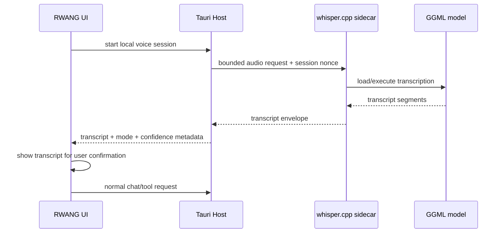

# Specification — Local Voice Command ASR

## 1. Purpose

Provide a local Windows/Tauri speech-to-text path for RWANG voice commands
using Whisper `large-v3-turbo`, without treating transcription as authorization
or allowing transcripts to bypass existing human approval gates.

## 2. Scope

### In scope

- Native Windows desktop ASR through a pinned `whisper.cpp` sidecar.
- Official `large-v3-turbo` GGML model acquisition and SHA-256 verification.
- Thai and English transcription for push-to-talk voice commands.
- Explicit UI mode disclosure and browser fallback.
- Bounded audio, transcript, timeout, shutdown, and error contracts.
- Static, local, packaged, and clean-machine verification boundaries.

### Out of scope

- Voice biometric authentication.
- Wake-word detection as an authorization mechanism.
- Automatic execution of external tools from transcript text.
- Cloud transcription.
- Removing the current browser `SpeechRecognition` fallback.
- Installing the model in Ollama's model store.

## 3. Current-state constraints

- The current browser path uses `SpeechRecognition`/`webkitSpeechRecognition`.
- Browser on-device recognition is optional and controlled by browser capability;
  RWANG cannot select a Whisper checkpoint through that API.
- The Tauri host already owns native process lifecycle and packaged resources.
- The repository does not currently contain a Whisper runtime, ASR sidecar, or
  local ASR model directory.

## 4. Architecture



### 4.1 Resource layout

The packaged layout must remain below the existing resource boundary:

```text
<resource-dir>/rwang/
  runtime/
    whisper/
      whisper-cli.exe
  models/
    whisper/
      ggml-large-v3-turbo.bin
      manifest.json
```

The source tree must not become the runtime model store. Development may use an
explicit absolute model override only when it points to an existing regular
file and the operator has selected local mode.

### 4.2 Runtime lifecycle

- Tauri starts the ASR sidecar only when local voice mode is selected and the
  user presses the microphone control.
- The sidecar emits newline-delimited JSON `ready` or `fatal` lifecycle events.
- A transcription session has a bounded maximum duration and output size.
- Tauri terminates the sidecar on session end and on application shutdown.
- A missing, corrupted, or incompatible model disables local mode and exposes
  browser fallback; it must not silently use another model.

## 5. Model and provenance contract

The model identity is the exact tuple below; values must be filled from the
verified acquisition artifact before implementation is accepted:

| Field | Required value |
|---|---|
| Model family | Whisper |
| Model name | `large-v3-turbo` |
| Format | GGML/whisper.cpp binary |
| File | `ggml-large-v3-turbo.bin` |
| Source | approved upstream whisper.cpp model registry |
| SHA-256 | required before packaging; not yet recorded |
| License/notice | required in package provenance |

The model manifest must include source URL, retrieval timestamp, version/ref,
SHA-256, file size, and runtime compatibility. A package with a missing or
mismatched manifest fails closed.

## 6. Transcript API contract

### 6.1 Start request

```json
{
  "type": "transcribe.start",
  "sessionId": "bounded-session-id",
  "language": "th",
  "audioFormat": "pcm_s16le",
  "sampleRateHz": 16000,
  "channels": 1,
  "maxDurationMs": 15000
}
```

Allowed languages are `th`, `en`, and `auto`. The default command language is
`th` for the Thai UI.

### 6.2 Result envelope

```json
{
  "ok": true,
  "type": "transcribe.result",
  "sessionId": "bounded-session-id",
  "mode": "local-whisper",
  "language": "th",
  "text": "สรุปสถานะระบบ",
  "segments": [
    { "startMs": 0, "endMs": 1400, "text": "สรุปสถานะระบบ" }
  ],
  "durationMs": 1400
}
```

The result must not contain raw audio, absolute filesystem paths, credentials,
or hidden device identifiers.

### 6.3 Error envelope

```json
{
  "ok": false,
  "type": "transcribe.error",
  "sessionId": "bounded-session-id",
  "code": "MODEL_UNAVAILABLE",
  "message": "Local voice model is unavailable"
}
```

Stable error codes: `MODEL_UNAVAILABLE`, `MODEL_HASH_MISMATCH`,
`RUNTIME_UNAVAILABLE`, `AUDIO_FORMAT_INVALID`, `AUDIO_TOO_LONG`,
`TRANSCRIPTION_TIMEOUT`, `TRANSCRIPTION_FAILED`, and `SESSION_CANCELLED`.

## 7. Privacy and authorization

- Audio is processed locally in `local-whisper` mode and is not sent to Ollama,
  browser vendors, or remote services.
- Audio buffers are memory-only and must be released after each session.
- Transcript text is visible to the user before any chat or external action.
- Existing approval cards remain mandatory for Home Assistant, MCP, and IoT
  actions.
- Voice Profile remains a convenience signal only and cannot authorize a command.
- Browser fallback must display `BROWSER VOICE` and may use the browser/vendor
  speech service according to existing documentation.

## 8. UI states

The microphone surface must expose exactly one of:

| State | Meaning |
|---|---|
| `LOCAL WHISPER READY` | Pinned runtime and model passed integrity checks |
| `LOCAL WHISPER LISTENING` | Local audio capture/transcription is active |
| `BROWSER VOICE` | Browser fallback is active |
| `VOICE UNAVAILABLE` | Neither local nor browser path is usable |
| `VOICE ERROR` | A bounded session failed; retry is available |

The UI must never label browser recognition as local Whisper.

## 9. Failure and fallback rules

1. Check runtime existence and model hash before starting capture.
2. If the check fails, do not start a partial local session.
3. Offer browser fallback only with explicit mode disclosure.
4. If local transcription times out, cancel the session and release resources.
5. If the transcript is empty, do not submit a chat request.
6. If the transcript is non-empty, preserve the existing user-send and approval
   path.

## 10. Verification plan

### Static/local

- Model manifest schema and SHA-256 check.
- Runtime argument allowlist and no-shell execution.
- Audio size/duration/output bounds.
- Sidecar ready/fatal/timeout/shutdown contract.
- Transcript JSON schema and error-code contract.
- Existing security, planner, desktop, and media regression suites.

### Functional

- Thai command fixture: `สรุปสถานะระบบ`.
- English command fixture: `summarize system status`.
- Empty/noise input produces no chat submission.
- Missing model produces `MODEL_UNAVAILABLE` and browser fallback.
- Hash mismatch produces `MODEL_HASH_MISMATCH` and no inference.
- Timeout terminates the sidecar and leaves no orphan process.

### Evidence boundaries

- Local test: engineering evidence only.
- Packaged desktop: package and sidecar evidence.
- Hosted Windows: CI/build evidence only.
- Clean Windows VM: installer, lifecycle, and release evidence.
- Real Thai voice accuracy and latency: target-device manual evaluation;
  cannot be inferred from static tests.

## 11. Definition of done

- Runtime and model are pinned, hash-verified, and packaged.
- Local transcription works for Thai and English fixtures.
- UI mode disclosure and browser fallback are correct.
- No audio leaves local mode.
- Existing authorization/approval behavior is unchanged.
- Static, local, packaged, hosted, and clean-machine evidence are recorded
  separately.
- Documentation, provenance, and release gates are updated.

## CHANGELOG

| Version | Date | Status | Summary | Commit Hash | Agent |
|---|---|---|---|---|---|
| 0.1.0b | 2026-09-21 | candidate | Define local whisper.cpp ASR, model provenance, transcript contract, privacy, fallback, and verification | UNCOMMITTED | RWANG |
