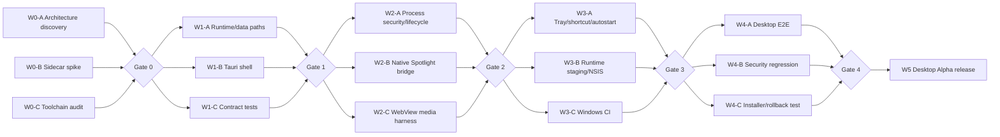

# RWANG Desktop migration DAG

This workflow migrates RWANG to a Windows-first Tauri v2 desktop application
without removing the browser/PWA entry point. Work is released in waves. A wave
may run tasks in parallel, but the next wave does not start until the integration
gate for the current wave is green.

## Execution policy

- Coordinator: root agent owns integration, conflict resolution, gates, and rollback.
- Workers: `gpt-5.6-luna` with reasoning effort `max`.
- Parallelism: tasks in the same wave must own disjoint files where possible.
- Baseline gate on every wave: `pnpm check`, `pnpm test:security`, and `git diff --check`.
- A failing gate stops downstream nodes; the coordinator fixes or reverts only the
  failing slice before resuming the DAG.
- Browser/PWA mode remains a supported rollback path until Desktop Stable.



## Wave contracts

| Wave | Parallel nodes | Integration gate |
|---|---|---|
| 0 | Architecture, sidecar packaging spike, Windows toolchain audit | Architecture and process contract accepted; baseline tests green |
| 1 | Runtime path separation, Tauri shell, contract tests | Tauri compiles; sidecar reports ready; health and data isolation pass |
| 2 | Process hardening, native Spotlight boundary, media parity harness | No orphan child; navigation/IPC policy passes; media results recorded |
| 3 | Native UX, portable runtime/NSIS, Windows CI | Clean-machine artifact builds and launches without developer tools |
| 4 | E2E, security regression, upgrade/uninstall/rollback | All acceptance criteria pass on Windows 11 and supported Windows 10 |
| 5 | Documentation, checksums/SBOM, GitHub release candidate | Desktop Alpha is reproducible and browser fallback remains available |

## Wave 1 sidecar contract

Tauri owns the desktop process and launches a Node sidecar bound to loopback.
The WebView loads the sidecar origin so existing relative API calls, SSE, NDJSON,
WebRTC, service workers, and CSP continue to work.

Required environment:

```text
RWANG_RESOURCE_DIR=<absolute read-only runtime directory>
RWANG_DATA_DIR=<absolute writable application-data directory>
RWANG_WORKSPACE_DIR=<absolute user-approved workspace directory>
RWANG_CAPABILITY_DIR=<absolute capability-pack directory>
RWANG_HOST=127.0.0.1
OLLAMA_CENTER_PORT=<coordinator-selected free port>
```

The sidecar emits one JSON `ready` event after the listener is accepting
connections, exposes a lightweight `GET /api/health`, and emits a JSON `fatal`
event before a startup failure exits non-zero. Tauri never passes credentials in
the URL or command line.

## Rollback rules

- Wave 1: remove the Tauri scaffold and continue using `Start RWANG.cmd`; runtime
  path defaults preserve the existing source-tree behavior.
- Wave 2: disable native capability nodes independently; retain the existing
  loopback Spotlight and browser media implementation.
- Wave 3: publish a portable Alpha artifact before enabling installer upgrades.
- Wave 4/5: an installer failure must not delete `%APPDATA%\RWANG`; reinstalling
  the previous signed version must restore operation with the same user data.

Auto-update, full Rust backend rewriting, macOS/Linux packaging, and content-level
file indexing are outside the Desktop Alpha DAG.
