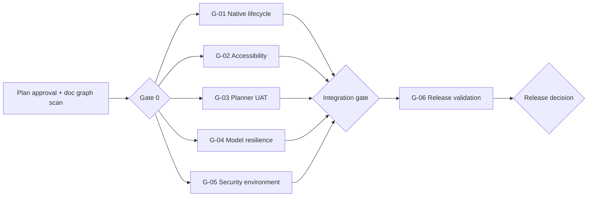

# RWANG Gap-Closure Plan

## 1. Objective

Close the documented UAT, accessibility, security-evidence, and Windows release
gaps without weakening existing assertions or presenting local evidence as
production readiness.

## 2. Baseline and evidence boundary

- Product version remains `0.5.0` until an explicit release decision.
- `docs/PRODUCTIVITY-GATE-REPORT.md` remains under review.
- Existing local checks are useful engineering evidence only.
- Hosted Windows CI, clean-machine installation, signing, and manual Windows
  10/11 VM checks are separate release gates.
- Browser/PWA remains the rollback path until Desktop Stable.

## 3. Gap workstreams

| ID | Workstream | Scope | Dependencies | Acceptance evidence | Parallelizable |
|---|---|---|---|---|---|
| G-01 | Native desktop lifecycle | launch, suspend/reopen, single-instance, shutdown, PWA cache upgrade | existing Tauri shell | reproducible Windows desktop run log | yes |
| G-02 | Accessibility | native 200% zoom, keyboard path, screen reader, responsive regression | stable UI candidate | recorded accessibility matrix | yes |
| G-03 | Planner UAT | archive handshake, validation branches, timezone/date matrix, concurrent edits | planner contract and fixture harness | named UI cases with retained evidence | yes |
| G-04 | Model resilience | offline, timeout, oversized/malformed model responses | Ollama fixture/mock boundary | no task/plan corruption and recovery evidence | yes |
| G-05 | Security environment | symlink/reparse-point cases and filesystem boundary checks | Windows environment permitting symlink creation | security test output with no skips | yes |
| G-06 | Release validation | hosted CI, clean Windows 10/11 VM, installer, upgrade, uninstall retention, rollback | G-01..G-05 green | signed/reproducible release candidate evidence | no, final gate |

## 4. DAG execution waves

## 5. Integration gates

### Gate 0 — Planning integrity

- This document approved.
- DAG scan completed.
- No unregistered or contradictory dependency is introduced.
- Workstream ownership is disjoint where possible.

### Gate 1 — Candidate acceptance

- `pnpm check`
- `pnpm test:security`
- `pnpm test:planner`
- `pnpm test:desktop-contract`
- `git diff --check`
- All remaining findings are classified as `PASS`, `PARTIAL`, or `NOT_RUN`.

### Gate 2 — Release decision

- Hosted CI is green.
- Clean-machine Windows 10/11 evidence is recorded.
- Installer checksum, launch, upgrade, uninstall data retention, and rollback
  are verified.
- Signing and publication require a separate explicit approval.

## 6. Non-goals

- No product version bump.
- No deployment or installer publication.
- No Calendar Sync.
- No weakening of security, accessibility, or authorization assertions.
- No unrelated refactoring or cleanup.

## 7. Definition of done

The gap plan is complete only when every workstream has named evidence, all
gates pass, remaining unknowns are explicitly documented, and release approval
is obtained for the exact candidate revision.

## CHANGELOG

| Version | Date | Status | Summary | Commit Hash | Agent |
|---|---|---|---|---|---|
| 0.1.0b | 2026-09-19 | candidate | Initial gap-closure plan with parallel workstreams and release gates | UNCOMMITTED | RWANG |
