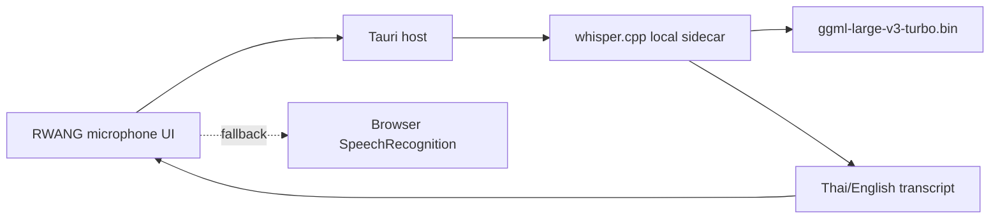

# Local Voice Command ASR Plan

## Decision proposal

Add local speech-to-text using `whisper.cpp` with the official GGML
`large-v3-turbo` model. Keep browser `SpeechRecognition` as an explicit
fallback for browsers/devices where the local desktop ASR path is unavailable.

This is the recommended path for the Windows/Tauri product because the current
desktop architecture already has a native host and a portable sidecar boundary,
while the repository has no Python ASR runtime.

## Current-state evidence

- `public/app.js` constructs `SpeechRecognition`/`webkitSpeechRecognition`.
- The current UI can request browser on-device processing when the browser
  exposes that capability, but it cannot select or load a Whisper checkpoint.
- `README.md` explicitly documents browser Web Speech API behavior and does not
  promise offline STT.
- `ollama` is reachable through the local API, but `large-v3-turbo` is an ASR
  checkpoint, not an Ollama chat model.

## Proposed runtime boundary

- The microphone stream remains local to the desktop process.
- The ASR sidecar accepts bounded audio input and returns transcript JSON only.
- No audio is sent to Ollama or a remote provider by the local path.
- Voice identity/profile remains separate and is never an authorization factor.
- Chat/tool approval behavior is unchanged after transcription.

## Installation scope

1. Acquire a pinned Windows `whisper.cpp` runtime or build artifact.
2. Acquire the official `large-v3-turbo` GGML model and verify SHA-256.
3. Store both under the packaged resource boundary, not in the source tree.
4. Add a health/ready contract and bounded transcription command.
5. Add a Tauri host route that exposes transcript results to the UI.
6. Add UI mode disclosure: `LOCAL WHISPER`, `BROWSER VOICE`, or unavailable.

The model is expected to consume approximately 1.5 GiB before runtime and
packaging overhead. The actual memory, latency, Thai accuracy, and command
false-positive rate must be measured on the target machine.

## Acceptance criteria

- No `ollama pull large-v3-turbo` is used as the ASR installation path.
- Model and runtime are pinned and hash-verified.
- Startup fails closed when the model is missing or corrupted.
- Audio never leaves the local machine in `LOCAL WHISPER` mode.
- Thai and English command fixtures produce a transcript or an explicit error.
- Browser fallback remains available and clearly disclosed.
- Voice transcript cannot bypass human approval or access-token checks.
- Tauri package contract, shutdown, and clean-machine evidence are updated.

## Open choice

This plan assumes `whisper.cpp` GGML as the runtime. Alternatives are:

- Python `openai-whisper`: broader Python dependency surface and a new runtime
  boundary.
- `faster-whisper`: CTranslate2/Python packaging and a converted model source;
  not the preferred first path for this Tauri product.

## Out of scope

- Voice biometric authentication.
- Automatic execution of external tools from transcript text.
- Removing browser SpeechRecognition fallback.
- Installing the model into Ollama's model store.

## CHANGELOG

| Version | Date | Status | Summary | Commit Hash | Agent |
|---|---|---|---|---|---|
| 0.1.0b | 2026-09-21 | candidate | Propose local whisper.cpp ASR boundary for large-v3-turbo voice commands | UNCOMMITTED | RWANG |
